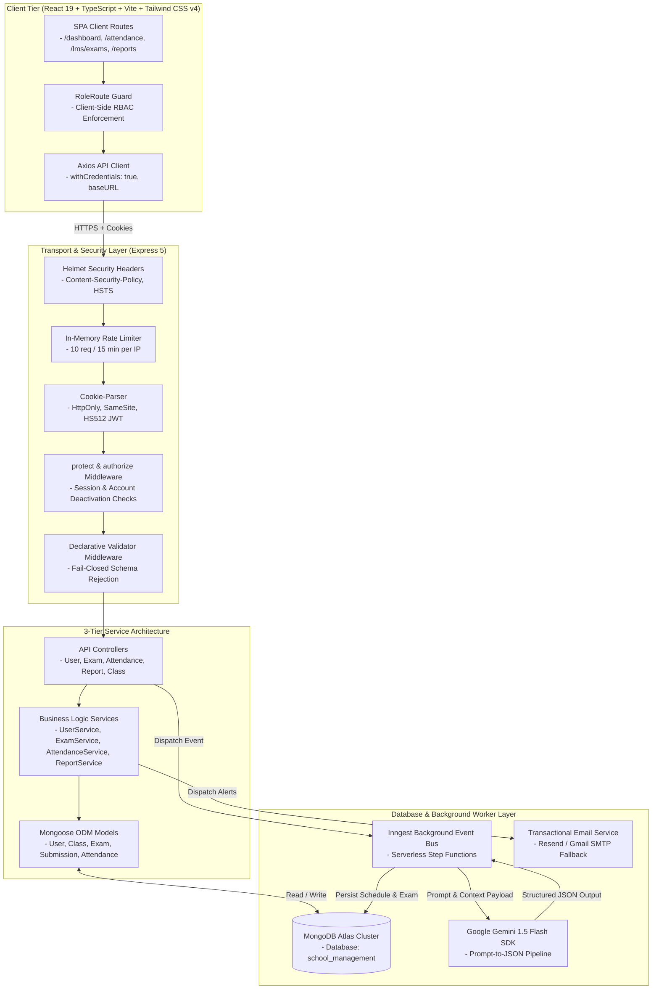
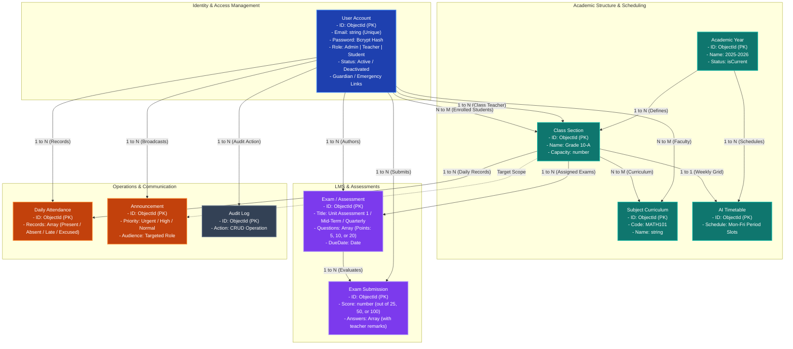

# SchoolSync — Enterprise Academic Operations & Management Platform

<div align="center">


<br/>

[](https://www.typescriptlang.org/)
[](https://react.dev/)
[](https://nodejs.org/)
[](https://expressjs.com/)
[](https://zod.dev/)
[](https://www.mongodb.com/)
[](https://tailwindcss.com/)
[](https://www.docker.com/)
[](https://github.com/Sekhar01807/School-Management/actions)
[](https://ai.google.dev/)
[](https://www.inngest.com/)
[](https://opensource.org/licenses/MIT)

<br/>

**SchoolSync** is an enterprise-grade, multi-role academic management and institution operations platform. Engineered with a strict 3-tier Service Architecture, AI timetable scheduling engines, multi-tiered institutional assessment matrix (Unit: 25, Mid-Term: 50, Quarterly: 100), dynamic cumulative CGPA (10.0 scale) and GPA (4.0 scale) analytics, faculty gradebook rosters, real-time daily attendance operations, automated low attendance email cron notifications, declarative Zod request validation, and multi-tenant resource isolation (IDOR protection).

[Overview](#executive-summary) • [UI Showcase](#application-ui-showcase--screenshots) • [Assessment Architecture](#institutional-assessment-matrix--grading-system) • [Architecture](#system-architecture) • [RBAC Matrix](#role-based-access-control-rbac) • [REST API Reference](#rest-api-specification) • [Deployment](#production-deployment-guide) • [Tests](#automated-testing--quality-assurance) • [Deployment Manual (DEPLOYMENT.md)](DEPLOYMENT.md)

</div>

---

## Table of Contents

1. [Executive Summary](#executive-summary)
2. [Application UI Showcase & Screenshots](#application-ui-showcase--screenshots)
3. [Institutional Assessment Matrix & Grading System](#institutional-assessment-matrix--grading-system)
4. [Core Subsystems & Technical Capabilities](#core-subsystems--technical-capabilities)
5. [Verified Seed Credentials](#verified-seed-credentials)
6. [System Architecture & Data Flow](#system-architecture)
7. [Database Relational Architecture](#database-relational-architecture)
8. [Role-Based Access Control (RBAC)](#role-based-access-control-rbac)
9. [REST API Specification](#rest-api-specification)
10. [Security Engineering & IDOR Hardening](#security-engineering--idor-hardening)
11. [Technology Stack](#technology-stack)
12. [Repository Structure](#repository-structure)
13. [Environment Variables](#environment-variables)
14. [Quickstart & Launch Options](#quickstart--launch-options)
15. [Automated Testing & Quality Assurance](#automated-testing--quality-assurance)
16. [Production Deployment Guide](#production-deployment-guide)
17. [License & Maintainers](#license--maintainers)

---

## Executive Summary

Modern educational institutions often grapple with fragmented software stacks: manual timetable collisions, disparate quiz tools, unverified attendance records, rigid assessment workflows, and broken object-level authorization (IDOR).

**SchoolSync** solves these challenges through a unified, 100% dynamic platform built on modern web standards:
- **Multi-Tiered Assessment Matrix:** Standardized institutional grading tiers configured for **Unit Assessment (25 Marks)**, **Mid-Term Examination (50 Marks)**, and **Quarterly Final Examination (100 Marks)** across all classes and core curriculum subjects.
- **Dynamic Cumulative CGPA & GPA:** Calculates exact weighted cumulative CGPA on a standard **10.0 scale** and GPA on a **4.0 scale** with instant letter-grade classifications (`A+` through `F`).
- **Teacher Gradebook & Quick Grading Portal:** Spacious, responsive roster interface with dynamic boundary enforcement, real-time score badges, live student search, and batch persistence.
- **Automated Low Attendance Alerts:** Background cron worker monitoring student attendance with automated threshold warnings (< 75%) and multi-tier email fallback (Resend API $\rightarrow$ Gmail SMTP).
- **Zero-Trust Access Control:** Cryptographically signed HS512 JWTs stored in `HttpOnly`, `SameSite=none`, `secure=true` cookies with role-based access guards.
- **Conflict-Free AI Scheduling:** Offloads complex weekly timetable optimization to asynchronous Inngest worker pipelines powered by Google Gemini 1.5 Flash.

---

## Application UI Showcase & Screenshots

### 1. Public Marketing Portal & User Personas

| Landing Page & Hero Showcase | Multi-Role Community Architecture |
| :---: | :---: |
|  |  |
| *Modern responsive marketing hero with instant onboarding CTAs* | *Role-segregated feature suites for Admins, Teachers, and Students* |

<br/>

### 2. Authentication & Student Registration

| Enterprise Secure Sign-In | Student Onboarding & Registration |
| :---: | :---: |
|  |  |
| *Session authentication with JWT cookies & password recovery* | *Real-time input validation, password strength meter & class selection* |

<br/>

### 3. Role-Adaptive Enterprise Dashboards

#### System Administrator Operations Hub

*Real-time institutional oversight: campus-wide attendance %, faculty/student body metrics, active academic sections, and quick administrative management triggers.*

<br/>

#### Faculty & Teacher Management Portal

*Assigned classroom sections, today's lecture schedule, student marks entry & quick grading shortcuts, and direct roll-call attendance access.*

<br/>

#### Enrolled Student Academic Hub

*Personal attendance metrics, cumulative CGPA & GPA cards, today's period schedule, academic standing badges, and direct report card navigation.*

<br/>

### 4. Academic Scheduling & Timetables

| Master Academic Timetable Grid | Student Class Timetable |
| :---: | :---: |
|  |  |
| *Section-by-section schedule with period slots, recess breaks, and assigned faculty* | *Student-personalized weekly class timetable with live bell schedule indicators* |

<br/>

#### Faculty Weekly Teaching Load & Schedule

*Faculty-specific schedule grid displaying weekly teaching load (25 periods), assigned classroom sections, and daily lecture slots.*

<br/>

### 5. Daily Attendance Operations & Analytics

| Class Roster Roll Call Register | Campus Attendance Statistics |
| :---: | :---: |
|  |  |
| *Fast attendance recording: Present, Late, Absent, Excused with batch presets* | *Campus-wide roll call rates, section completion trackers, and date picker* |

<br/>

#### Student Personal Attendance Record

*Personal attendance breakdown: attendance rate (95.7%), total days present (44/46), absence count, and statutory eligibility indicators.*

<br/>

### 6. Faculty Gradebook & Performance Reports

| Faculty Gradebook & Marks Entry | Academic Reports Verification Matrix |
| :---: | :---: |
|  |  |
| *Spacious 2-row setup, dynamic boundary validation (Max 100), and auto-calculated grades* | *Class assessment averages, pass rates (93%), highest scores, and verification printout* |

<br/>

| Classwide Analytics & Score Distribution | Official Student Academic Report Card |
| :---: | :---: |
|  |  |
| *Interactive score distribution charts, performance brackets, and subject averages* | *Cumulative CGPA (9.8/10), final grade A+, subject points earned, and standing* |

<br/>

### 7. Communication & Profile Management

| Campus Noticeboard & Announcements | Personal Profile & Identity Management |
| :---: | :---: |
|  |  |
| *Institutional circulars with priority flags (Urgent, General) and role targeting* | *Self-service profile details, contact updates, address, and avatar management* |

---

## Institutional Assessment Matrix & Grading System

SchoolSync establishes a standardized 3-tier institutional examination framework across all core curriculum subjects (*Telugu, English, Mathematics, Physics, Chemistry, Social Studies*). Non-academic activities such as Study Hours (`STD101`) are strictly excluded from grading and analytics.

### 1. Standard Assessment Tiers

| Assessment Tier | Max Marks | Question Structure | Typical Score Range | Evaluation Focus |
| :--- | :---: | :--- | :---: | :--- |
| **Unit Assessment 1** | **25 Marks** | 5 questions $\times$ 5 points each | `8 – 25 / 25` | Formative concept comprehension |
| **Mid-Term Examination** | **50 Marks** | 5 questions $\times$ 10 points each | `18 – 50 / 50` | Mid-semester cumulative depth |
| **Quarterly Final Examination** | **100 Marks** | 5 questions $\times$ 20 points each | `36 – 100 / 100` | Comprehensive summative evaluation |

### 2. Cumulative CGPA & GPA Calculation Formulas

Overall student academic performance is computed dynamically based on total earned marks across all attempted examinations:

$$\text{Overall Percentage (\%)} = \left(\frac{\sum \text{Marks Scored}}{\sum \text{Maximum Possible Marks}}\right) \times 100$$

$$\text{Cumulative CGPA (10.0 Scale)} = \left(\frac{\text{Overall Percentage}}{100}\right) \times 10.0$$

$$\text{Cumulative GPA (4.0 Scale)} = \left(\frac{\text{Overall Percentage}}{100}\right) \times 4.0$$

### 3. Official Letter Grade & Standing Scale

| Score Percentage | Letter Grade | CGPA (10.0) | GPA (4.0) | Academic Standing |
| :---: | :---: | :---: | :---: | :--- |
| **90% – 100%** | `A+` | 9.00 – 10.00 | 3.60 – 4.00 | Distinction / Highest Honors |
| **80% – 89%** | `A` | 8.00 – 8.99 | 3.20 – 3.59 | Excellent / First Class |
| **70% – 79%** | `B` | 7.00 – 7.99 | 2.80 – 3.19 | Good / Second Class |
| **60% – 69%** | `C` | 6.00 – 6.99 | 2.40 – 2.79 | Satisfactory |
| **50% – 59%** | `D` | 5.00 – 5.99 | 2.00 – 2.39 | Pass Threshold |
| **Below 50%** | `F` | < 5.00 | < 2.00 | Remedial Coaching Required |

---

## Core Subsystems & Technical Capabilities

### 1. Role-Adaptive Dynamic Dashboard
- **Admin Hub:** Campus metrics including total active student body, faculty directory count, ongoing exams, campus-wide daily attendance rate, and real-time management shortcuts.
- **Teacher Hub:** Assigned classroom count, daily lecture agenda, today's roll call indicator, and an integrated **Student Marks Entry & Gradebook** portal.
- **Student Hub:** Today's lecture timetable, cumulative CGPA & GPA scorecards, attendance percentage tracker with threshold warnings, and upcoming assessment schedules.
- **Parent Hub:** Direct visibility into linked children's daily attendance records, cumulative report card, and school announcements.

### 2. Faculty Gradebook & Quick Marks Entry Portal
- **Spacious 2-Row Form Architecture:** Clean, ergonomic dropdowns with dedicated selectors for Class Section, Subject, and Assessment.
- **Dynamic Boundary Clamping:** Score input dynamically validates against active assessment max marks (`/ 25`, `/ 50`, `/ 100`).
- **Complete Class Roster:** Displays all enrolled students per class section with instant score-to-grade badge calculation (`A+`, `A`, `B`, `F`).
- **Batch Persistence:** Saves grades in a single transactional request to MongoDB with qualitative teacher remarks.

### 3. Conflict-Free AI Timetable Generator
- **Engine:** Inngest serverless step functions paired with Google Gemini 1.5 Flash structured output schemas.
- **Constraint Solver Enforces:**
  - Zero double-booking across faculty schedules during identical time periods.
  - Zero classroom space collisions across overlapping academic sections.
  - Teacher-subject qualification alignment (`MATH101`, `PHY101`, `CHEM101`, `TEL101`, `ENG101`, `SOC101`).
  - Configurable periods per day, custom period durations (30–60 mins), and automated lunch breaks.

### 4. Online Assessment & LMS Exam Engine
- **AI Question Synthesis:** Faculty input topic, subject, difficulty, and question count; Gemini AI produces structured questions with validated answers.
- **Automated Deadline Guardrails:** Draft exams cannot be published without questions or with expired due dates.
- **Answer Key Defense:** Correct answers are sanitized and stripped from all student-facing endpoints; exposed strictly to the authoring faculty member or administrators.
- **Automated Grading:** Student answers are evaluated against server-side keys with immediate percentage and grade computation.

### 5. Campus Daily Attendance Operations & Email Alerts
- **Daily Register:** Teachers and administrators record attendance per class with distinct status flags: `Present`, `Absent`, `Late`, `Excused`.
- **Institutional Analytics:** Real-time campus-wide attendance percentage, class-level distribution, and historical logs.
- **Automated Low Attendance Cron:** Automated background job checking student attendance rates every 24 hours. Automatically sends warning emails to students and parents when attendance falls below 75%.
- **Multi-Tier Email Fallback:** Seamless delivery via Resend API with automated fallback to Gmail SMTP.

### 6. Institutional Announcements & Broadcasts
- **Targeted Audience Routing:** Broadcast notices institution-wide (`All`), to faculty (`Teachers`), to learners (`Students`), or to specific grade sections.
- **Priority Categorization:** Flagged with urgency tiers: `Urgent`, `High`, `Medium`, and `Low`.
- **Author Scoping:** Authors and administrators maintain full edit/delete privileges with instantaneous broadcast updates.

### 7. Universal Directory & User Management
- **Directory Management:** Role-segregated views for Students, Teachers, Parents, and Administrators.
- **ReDoS-Safe Search & Pagination:** All search queries are filtered through regex metacharacter escapers prior to database execution.
- **Privilege Boundary Enforcement:** Faculty can create and update student accounts, but are strictly barred from modifying other faculty or elevating roles.

### 8. Institutional CSV Data Exports
- **Attendance Register Export:** Streams monthly class attendance matrices in RFC-4180 Excel-compatible CSV.
- **Report Card Export:** Exports full student academic transcripts with subject points, percentages, letter grades, and cumulative CGPA.
- **Student Roster Export:** Exports searchable student directory with emergency contact details.

---

## Verified Seed Credentials

> [!WARNING]
> **DEVELOPMENT & DEMO SANDBOX ONLY**: The following accounts are pre-seeded solely for local development, automated testing, and evaluation sandboxes. In production deployments, default credentials are strictly blocked by the seed validator; administrators must supply unique, cryptographically strong passwords via environment variables (`DEFAULT_ADMIN_PASSWORD`).

The database includes pre-configured demo credentials initialized on boot (in development) or explicitly via `npm run db:seed`:

| Account Role | Display Name | Email | Demo Password (Dev Only) | Pre-Assigned Context |
| :--- | :--- | :--- | :--- | :--- |
| **System Administrator** | Prabhas Uppalapati | `admin@schoolsync.com` | `password123` | Full institutional access across all modules & settings |
| **Faculty Member** | Ravi Teja Bhupathi | `teacher@schoolsync.com` *(alt: `raviteja@schoolsync.com`)* | `password123` | Assigned to Grade 10-A / Grade 10-B (Mathematics) |
| **Enrolled Student** | Sekhar Reddy | `student@schoolsync.com` | `password123` | Enrolled in **Grade 10-A** (Parent: Venkat Reddy) |

> [!NOTE]
> Seed credentials and startup auto-seeding are fully configurable via environment variables (`DEFAULT_ADMIN_EMAIL`, `DEFAULT_ADMIN_PASSWORD`, `SEED_DEFAULT_DATA=true`). In production environments, database seeding strictly requires custom credentials (`DEFAULT_ADMIN_PASSWORD`) and will reject insecure defaults (`password123`).

---

## System Architecture



---

## Database Relational Architecture



---

## Role-Based Access Control (RBAC)

SchoolSync enforces a Zero-Trust, Multi-Tenant Role-Based Access Control system. Permissions are strictly checked server-side via cryptographically signed JWT cookies (`protect`), role-level authorization guards (`authorize(["admin", "teacher", "student"])`), and granular object-level authorization helpers (`canAccessStudentData`, `canAccessClassData`).

### 1. Master RBAC Matrix

| Functional Domain | Resource / Operation | System Administrator (`admin`) | Faculty Member (`teacher`) | Enrolled Student (`student`) | IDOR & Multi-Tenant Boundary Guard |
| :--- | :--- | :---: | :---: | :---: | :--- |
| **Authentication & Sessions** | Sign In (`/api/users/login`) | Full Access | Full Access | Full Access | Rate-limited (10 req / 15m), HttpOnly JWT cookie |
| | Public Sign Up (`/api/users/register`) | Any Role | Student Role Only | Student Role Only | Public registration locked to `student` role |
| | Sign Out (`/api/users/logout`) | Full Access | Full Access | Full Access | Clears session cookie |
| **Self-Service & Profile** | View & Update Profile (`/api/users/profile`) | Own Profile | Own Profile | Own Profile | Strictly scoped to caller's `req.user._id` |
| | Change Password (`/api/users/change-password`) | Own Account | Own Account | Own Account | Requires current password validation |
| | Forgot/Reset Password (`/api/users/*password`) | Full Access | Full Access | Full Access | 15-min SHA-256 token, host-header poison defense |
| | Avatar Upload (`/api/upload/avatar`) | Full Access | Full Access | Full Access | Max 2MB (JPEG/PNG/WebP), updates user profile |
| **System Settings** | Manage Academic Years (CRUD) | Full Access | View All | View Active | Only Admin can create, modify, or activate years |
| **Academic Structure** | Manage Classes (Create/Edit/Delete) | Full Access | View All & Assigned | View Enrolled | Capacity clamping & assigned class teacher link |
| | Manage Subjects (Create/Edit/Delete) | Full Access | View All & Assigned | View Enrolled | Unique uppercase subject codes (`MATH101`, etc.) |
| **User Directory** | View Directory (`GET /api/users`) | All Accounts | Enrolled Students | No Access | Teachers restricted to student body; Students barred |
| | Manage Faculty & Admins | Full Access | No Access | No Access | Privilege escalation & self-deletion protection |
| | Manage Students | Full Access | Assigned Classes | No Access | Faculty can register/update enrolled students |
| **AI Timetable Engine** | Generate AI Timetable (Gemini AI) | Full Access | No Access | No Access | Inngest worker solves faculty/room collisions |
| | Manual Timetable Override/Save | Full Access | No Access | No Access | Direct grid persistence by Admin |
| | View Class Timetable | All Classes | Assigned Classes | Enrolled Class Only | Students restricted to their enrolled class |
| **LMS & Assessments** | AI Quiz Synthesis (Gemini AI) | Full Access | Authored Subjects | No Access | Structured 25 / 50 / 100 mark exam templates |
| | Exam Publish / Draft Toggle | Full Access | Authored Exams | No Access | Requires >= 1 question and non-expired due date |
| | View Questions & Answer Keys | Full Access | Authored Exams | Keys Sanitized | Answer keys stripped server-side for students |
| | Take Exam & Submit Answers | Blocked (Staff) | Blocked (Staff) | Enrolled Class Only | 1 submission per student per exam, auto-graded |
| | View Exam Results & Feedback | All Results | Authored/Class | Own Results Only | IDOR protected via `canAccessStudentData` |
| | Delete Exam & Submissions | Full Access | Authored Exams | No Access | Cascades deletion of all associated submissions |
| **Faculty Gradebook** | Batch Marks Entry (`/reports/marks/batch`) | Full Access | Assigned Classes | No Access | Bound to 25, 50, 100 max marks with letter grades |
| | Fetch Class Marks Roster | All Classes | Assigned Classes | No Access | Scoped to assigned class & subject |
| **Daily Attendance** | Mark Roll Call (`POST /attendance`) | All Classes | Assigned Classes | No Access | Validates teacher is assigned to class section |
| | Campus Attendance Overview | Campus-wide | Campus Overview | No Access | Aggregated percentage and class completion rates |
| | Student Attendance Summary | All Students | Assigned Students | Own Record Only | IDOR protected (`/attendance/student/me` vs `:id`) |
| | Class Attendance Register | All Classes | Assigned Classes | No Access | Date-filtered daily roll call records |
| | Low Attendance Auto-Alerts | Automated Cron | Automated Cron | Email Alerts | Automated alerts for attendance < 75% |
| **Announcements** | Publish Announcement | All Audiences | Targeted Audiences | No Access | Urgency tiers (Urgent, High, Medium, Low) |
| | Edit / Delete Announcement | All Broadcasts | Authored Only | No Access | Author scoping with Admin override |
| | View Broadcast Notices | All Notices | Teacher/All | Student/All/Class | Filtered by caller role and enrolled class |
| **Performance Reports** | Official Student Report Card | All Students | Assigned Students | Own Report Card | 10.0 CGPA & 4.0 GPA with subject breakdowns |
| | Class Performance Analytics | All Classes | Assigned Classes | No Access | Score distribution, pass rates, and class averages |
| | Campus Performance Scorecard | Campus-wide | Campus-wide | No Access | Institution-wide academic performance overview |
| **Data Export (CSV)** | Export Attendance CSV | All Classes | Assigned Classes | No Access | RFC-4180 Excel CSV with UTF-8 BOM |
| | Export Student Report Card CSV | All Students | Assigned Students | Own Report Card | Streams student GPA transcript in CSV format |
| | Export Student Directory CSV | All Students | Assigned Classes | No Access | Searchable directory export with emergency contacts |
| **System Operations** | Activity Audit Logs (`/activities`) | Full Access | No Access | No Access | Immutable audit logs of administrative actions |
| | Live Test Email Dispatch (`/email/test`) | Full Access | No Access | No Access | Rate-limited (5 req / 15m), schema validated |
| | Trigger Background Cron (`/email/trigger-cron`)| Full Access | No Access | No Access | Manual trigger for exam & attendance workers |
| | Email Provider Health (`/email/status`)| Public / Health | Public / Health | Public / Health | Resend & Gmail SMTP connectivity check |

### 2. Role Architecture & Persona Boundaries

```
┌────────────────────────────────────────────────────────────────────────────────────────┐
│                                 SCHOOLSYNC USER ROLES                                  │
├───────────────────────┬────────────────────────────────┬───────────────────────────────┤
│  ADMINISTRATOR        │  FACULTY (TEACHER)             │  STUDENT (LEARNER)            │
│  Role: "admin"        │  Role: "teacher"               │  Role: "student"              │
├───────────────────────┼────────────────────────────────┼───────────────────────────────┤
│ • Full institutional  │ • Assigned classroom oversight │ • Personalized dashboard      │
│   oversight           │ • Roll call attendance logging │ • Daily lecture timetable     │
│ • Academic Years CRUD │ • Faculty Gradebook & batch    │ • Online quiz taking & auto-  │
│ • Class & Subject     │   marks entry (25/50/100)      │   grading feedback            │
│   management          │ • AI Quiz generation & author- │ • Official Report Card with   │
│ • AI Timetable solver │   ing for qualified subjects   │   CGPA (10.0) & GPA (4.0)     │
│ • User Directory CRUD │ • Class analytics & averages   │ • Attendance rate tracking &  │
│ • Audit log review    │ • Student directory access     │   threshold alerts (<75%)     │
│ • Transactional email │ • Targeted announcements       │ • CSV Report Card export      │
│   dispatch & test     │ • CSV export for assigned data │ • Self profile & avatar update│
└───────────────────────┴────────────────────────────────┴───────────────────────────────┘
```

> [!NOTE]
> **Parent & Guardian Data Linkage:**
> While the three primary authenticated platform roles are `admin`, `teacher`, and `student`, student records maintain integrated guardian metadata (`emergencyContact.name`, `emergencyContact.phone`, `emergencyContact.relationship`, and relational `parentId`/`children` linkages). Automated attendance cron jobs (<75% threshold) and institutional broadcast alerts are dispatched directly to student and linked guardian email endpoints.

---

## REST API Specification

### 1. Authentication & User Management (`/api/users`)
| Method | Endpoint | Authorization | Description |
| :--- | :--- | :--- | :--- |
| `POST` | `/api/users/login` | Public (Rate-Limited) | Authenticates credentials and issues secure HS512 JWT cookie |
| `POST` | `/api/users/register` | Public / Admin / Teacher | Registers new user (Public/Teachers strictly restricted to `student` role) |
| `POST` | `/api/users/logout` | Public / Authenticated | Clears and expires authentication cookie |
| `GET` | `/api/users/profile` | Authenticated | Retrieves current authenticated user session profile |
| `PUT` | `/api/users/profile` | Authenticated | Self-service profile updates (Name, phone, address, emergency contact, avatar) |
| `PUT` | `/api/users/change-password` | Authenticated | Self-service password change with current password verification |
| `POST` | `/api/users/forgot-password` | Public (Rate-Limited) | Dispatches cryptographic 15-minute password reset link to registered email |
| `POST` | `/api/users/reset-password` | Public (Rate-Limited) | Validates SHA-256 token and resets account password |
| `GET` | `/api/users` | Admin / Teacher | Searchable & paginated user directory (Teachers restricted to students) |
| `PUT` | `/api/users/update/:id` | Admin | Updates user attributes, status, and role assignments (PUT & PATCH) |
| `DELETE` | `/api/users/delete/:id` | Admin | Removes user account (Protected against self-deletion) |

### 2. Academic Years (`/api/academic-years`)
| Method | Endpoint | Authorization | Description |
| :--- | :--- | :--- | :--- |
| `GET` | `/api/academic-years/current` | Authenticated | Retrieves the current active academic year |
| `GET` | `/api/academic-years` | Admin / Teacher | Retrieves all academic years with current active flag |
| `POST` | `/api/academic-years/create` | Admin | Creates new academic year with single-active constraint |
| `PUT` | `/api/academic-years/update/:id` | Admin | Updates academic year configuration (PUT & PATCH) |
| `DELETE` | `/api/academic-years/delete/:id` | Admin | Removes academic year record |

### 3. Classes & Sections (`/api/classes`)
| Method | Endpoint | Authorization | Description |
| :--- | :--- | :--- | :--- |
| `GET` | `/api/classes` | Authenticated | Paginated list of classes with enrolled students & assigned subjects |
| `GET` | `/api/classes/:id` | Authenticated | Detailed class view with teacher assignments & enrolled students |
| `POST` | `/api/classes/create` | Admin | Registers new class section with capacity and class teacher assignment |
| `PUT` | `/api/classes/update/:id` | Admin | Modifies class configuration and curriculum (PUT & PATCH) |
| `DELETE` | `/api/classes/delete/:id` | Admin | Removes class section |

### 4. Subject Curriculums (`/api/subjects`)
| Method | Endpoint | Authorization | Description |
| :--- | :--- | :--- | :--- |
| `GET` | `/api/subjects` | Authenticated | Paginated list of academic curriculum subjects |
| `POST` | `/api/subjects/create` | Admin | Registers new subject with unique code uppercase validation (`MATH101`) |
| `PUT` | `/api/subjects/update/:id` | Admin | Modifies subject details and assigned teachers (PUT & PATCH) |
| `DELETE` | `/api/subjects/delete/:id` | Admin | Removes subject from curriculum |

### 5. AI Timetable Scheduling (`/api/timetables`)
| Method | Endpoint | Authorization | Description |
| :--- | :--- | :--- | :--- |
| `POST` | `/api/timetables/generate` | Admin | Dispatches AI timetable optimization (Gemini AI / Inngest worker) |
| `POST` | `/api/timetables/manual` | Admin | Saves or overrides weekly timetable grid manually |
| `GET` | `/api/timetables/:classId` | Authenticated | Retrieves weekly schedule (Students restricted to enrolled class) |

### 6. LMS & AI Assessment Engine (`/api/exams`)
| Method | Endpoint | Authorization | Description |
| :--- | :--- | :--- | :--- |
| `POST` | `/api/exams/generate` | Admin / Teacher | Dispatches AI quiz synthesis with topic, subject, difficulty, & count |
| `GET` | `/api/exams` | Authenticated | Lists exams (Role-filtered: student enrolled class, teacher authored) |
| `GET` | `/api/exams/:id` | Authenticated | Retrieves exam details (Answer keys stripped server-side for students) |
| `PATCH` | `/api/exams/:id/status` | Admin / Teacher | Toggles draft/published state (Validates deadline & question count) |
| `POST` | `/api/exams/:id/submit` | Student | Submits exam answers for automated grading and instant feedback |
| `GET` | `/api/exams/:id/result` | Authenticated | Returns score breakdown, percentage, and grade letter (IDOR guarded) |
| `DELETE` | `/api/exams/:id` | Admin / Teacher | Cascades deletion of exam and all associated student submissions |

### 7. Daily Attendance Operations (`/api/attendance`)
| Method | Endpoint | Authorization | Description |
| :--- | :--- | :--- | :--- |
| `POST` | `/api/attendance` | Admin / Teacher | Records class roll call: Present, Absent, Late, Excused (Assigned teachers) |
| `GET` | `/api/attendance/overview` | Admin / Teacher | Campus-wide attendance summary, daily rates, and 7-day trend |
| `GET` | `/api/attendance/student/me` | Student | Retrieves student personal attendance record and statutory threshold status |
| `GET` | `/api/attendance/student/:studentId` | Admin / Teacher | IDOR-protected attendance summary for a specific student |
| `GET` | `/api/attendance/class/:classId` | Admin / Teacher | Class attendance register by date or date range |

### 8. Institutional Announcements (`/api/announcements`)
| Method | Endpoint | Authorization | Description |
| :--- | :--- | :--- | :--- |
| `GET` | `/api/announcements` | Authenticated | Retrieves announcements targeted to the caller's role / class |
| `POST` | `/api/announcements` | Admin / Teacher | Publishes announcement with audience (`all`, `teacher`, `student`, `class`) & priority |
| `PUT` | `/api/announcements/:id` | Admin / Author | Updates announcement content, priority, or expiration |
| `DELETE` | `/api/announcements/:id` | Admin / Author | Deletes announcement broadcast |

### 9. Performance Reports & Marks Gradebook (`/api/reports`)
| Method | Endpoint | Authorization | Description |
| :--- | :--- | :--- | :--- |
| `GET` | `/api/reports/student/me` | Student | Official student report card with cumulative CGPA (10.0) & GPA (4.0) |
| `GET` | `/api/reports/student/:studentId` | Admin / Teacher | IDOR-protected student report card and academic transcript |
| `GET` | `/api/reports/marks/class/:classId/subject/:subjectId` | Admin / Teacher | Retrieves batch assessment marks and class roster for grading |
| `POST` | `/api/reports/marks/batch` | Admin / Teacher | Batch saves assessment marks and remarks (25, 50, 100 max marks) |
| `GET` | `/api/reports/class/:classId` | Admin / Teacher | Computes class averages, score distribution brackets, and pass rates |
| `GET` | `/api/reports/school` | Admin / Teacher | Campus-wide academic metrics and institutional scorecard |

### 10. Institutional CSV Exports (`/api/export`)
| Method | Endpoint | Authorization | Description |
| :--- | :--- | :--- | :--- |
| `GET` | `/api/export/attendance/:classId` | Admin / Teacher (Assigned) | Streams monthly class attendance matrix in Excel RFC-4180 CSV |
| `GET` | `/api/export/report-card/:studentId` | Admin / Teacher / Student [Self] | Streams student GPA transcript & assessment report card in CSV |
| `GET` | `/api/export/students` | Admin / Teacher (Assigned) | Streams searchable student directory roster with emergency contacts in CSV |

### 11. Media & Profile Uploads (`/api/upload`)
| Method | Endpoint | Authorization | Description |
| :--- | :--- | :--- | :--- |
| `POST` | `/api/upload/avatar` | Authenticated | Uploads user profile image (Max 2MB, JPEG/PNG/WebP) and updates avatar URL |

### 12. Transactional Email & Engine Health (`/api/email`)
| Method | Endpoint | Authorization | Description |
| :--- | :--- | :--- | :--- |
| `GET` | `/api/email/status` | Public / Admin | Health & connection status of Resend / SMTP email delivery tiers |
| `POST` | `/api/email/test` | Admin | Dispatches live test verification email (Rate-limited: 5/15m & validated) |
| `POST` | `/api/email/trigger-cron` | Admin | Manually triggers background cron tasks (exam reminders & attendance check) |

### 13. Dashboard Analytics (`/api/dashboard`)
| Method | Endpoint | Authorization | Description |
| :--- | :--- | :--- | :--- |
| `GET` | `/api/dashboard/stats` | Authenticated | Dynamic role-adaptive metrics (Admin campus stats, Teacher grading widgets, Student CGPA/schedule) |

### 14. Audit & Security Activity Logs (`/api/activities`)
| Method | Endpoint | Authorization | Description |
| :--- | :--- | :--- | :--- |
| `GET` | `/api/activities` | Admin | Retrieves chronological administrative mutation and security audit logs |

---

## Security Engineering & IDOR Hardening

1. **Strict CORS Policy & Origin Isolation:**
   - Cross-origin requests are strictly validated against explicitly configured whitelist domains (`CLIENT_URL`), rejecting generic wildcard (`*.vercel.app`) domains. Disallowed origins immediately fail closed with `Not allowed by CORS`, preventing unauthorized cross-origin credentialed access.
2. **Multi-Tenant Export Authorization & IDOR Defense:**
   - Attendance and report card CSV export endpoints (`/api/export/*`) enforce strict multi-tenant boundary checks (`canAccessClassData` and `canAccessStudentData`). Unassigned teachers are blocked from retrieving data for classes or students outside their assignment.
3. **Password Reset Host Header Poisoning Mitigation:**
   - Password recovery emails construct reset URLs strictly from configured environment domains (`CLIENT_URL`), preventing token leakage through poisoned request headers.
4. **Public Registration Role Escalation Defense:**
   - Public unauthenticated registration (`POST /api/users/register`) strictly forces `role = "student"`. Requests requesting `admin`, `teacher`, or `parent` roles without admin authentication are rejected with `403 Forbidden`.
5. **Attendance Authorization Enforcement:**
   - Class attendance recording (`POST /api/attendance`) and inspection (`GET /api/attendance/class/:classId`) require teachers to be assigned as either the class teacher or subject teacher for the target section.
6. **Student Record IDOR Protection:**
   - Access to `/api/attendance/student/:studentId` and `/api/reports/student/:studentId` enforces centralized tenant boundaries (`canAccessStudentData`). Parents can only view their registered children; teachers can only view students in classes they teach; students can only view themselves.
7. **Environment-Controlled Seeding & Production Credential Hardening:**
   - Automatic database seeding is disabled by default in `production` environments.
   - When explicitly invoked in production, the seed pipeline validates that `DEFAULT_ADMIN_PASSWORD` is supplied, non-empty, and distinct from the demo default (`password123`), halting execution if insecure defaults are detected.
8. **NoSQL Query & Parameter Sanitization:**
   - Global recursive sanitization middleware ([`sanitize.ts`](backend/src/middleware/sanitize.ts)) strips MongoDB injection keys (`$where`, `$gt`, `$ne`, and dot-notation paths) from all incoming request bodies, query strings, and route parameters.
9. **Multi-Tier Rate Limiting Defense:**
   - Dedicated in-memory rate limiters protect authentication (`/login`), password recovery (`/forgot-password`), new account registration (`/register`), report export streams (`/export/*`), and live email dispatch testing (`/email/test`).
10. **HttpOnly Cross-Origin Cookie Security:**
    - Tokens are cryptographically signed using **HS512** with a 30-day lifecycle.
    - Delivered via `HttpOnly`, `SameSite=none`, `secure=true` cookies in production, eliminating browser-based XSS token theft.

---

## Technology Stack

```
FRONTEND LAYER                          BACKEND LAYER                           DATABASE & AI / DEVOPS
├── React 19.2.0                        ├── Express.js 5.2.1                   ├── MongoDB Atlas (v7.5)
├── TypeScript 5.9.3                    ├── TypeScript 5.9.3                   ├── Mongoose ODM 9.1.1
├── Vite 7.2.5 (Rolldown)               ├── Zod 3.24.2 (Validation Engine)     ├── Google Gemini 1.5 Flash
├── Tailwind CSS v4.1.18                ├── TSX 4.19.3 (Runtime Engine)        ├── Inngest Event Bus (3.48)
├── Radix UI Primitives                 ├── JSONWebToken (HS512)               ├── Resend API & Gmail SMTP
├── Lucide React 0.562.0                ├── BcryptJS 3.0.3                     ├── Docker & Docker Compose
├── React Router v7.11.0                ├── Helmet 8.1.0 (CORP Configured)     ├── Nginx 1.27 Alpine
└── Recharts 2.15.4                     ├── Cookie-Parser 1.4.7                └── GitHub Actions CI/CD
```

---

## Repository Structure

```text
School-Management/
├── .github/
│   └── workflows/
│       ├── ci.yml               # Automated multi-matrix Node 20/22 test & build pipeline
│       └── docker.yml           # Docker container build & compose validation workflow
├── package.json                 # Monorepo root workspace scripts (npm test, npm run dev...)
├── backend/
│   ├── src/
│   │   ├── config/              # MongoDB connection & system bootstrap (seedDefaultData.ts)
│   │   ├── controllers/         # HTTP Transport controllers (User, Exam, Attendance, Report...)
│   │   ├── services/            # Business Logic layer (UserService, ExamService, ReportService...)
│   │   ├── validators/          # Declarative, type-safe Zod validation schemas (schemas.ts)
│   │   ├── inngest/             # AI event workflows (Timetable & Quiz generators)
│   │   ├── middleware/          # JWT Protect, Role Authorizer, Rate Limiter, Validate (Zod)
│   │   ├── models/              # Mongoose schemas (User, Class, Exam, Submission, Attendance...)
│   │   ├── routes/              # Express API route declarations
│   │   ├── tests/               # 93 Automated Node.js native test suites (node:test | 207 tests)
│   │   ├── scripts/             # Database seed & cleanup utilities (cleanDb.ts, seed.ts)
│   │   ├── utils/               # Structured logger, token generators, email dispatchers
│   │   └── server.ts            # Entrypoint, reverse-proxy trust, CORS, & health checks
│   ├── Dockerfile               # Production Node 20 Alpine container
│   ├── tsconfig.json
│   ├── package.json
│   └── .env.example
├── frontend/
│   ├── src/
│   │   ├── components/          # Reusable UI widgets, forms, dialogs, sidebars
│   │   ├── hooks/               # Authentication & theme context providers
│   │   ├── lib/                 # Axios client instance & distributed avatar URL resolver
│   │   ├── pages/               # Application routes
│   │   │   ├── Dashboard.tsx    # Multi-role dashboard with Teacher Quick Marks Widget
│   │   │   ├── NotFound.tsx     # 404 / 403 Smart Error Page
│   │   │   ├── academics/       # Classes, Subjects, Timetable, Attendance, Reports
│   │   │   ├── communication/   # Announcements
│   │   │   ├── lms/             # Quiz taking & Exam Generator
│   │   │   └── users/           # Students, Teachers, Parents, Admins
│   │   ├── types.ts             # Global TypeScript interface definitions
│   │   ├── index.css            # Tailwind CSS design system configuration
│   │   └── main.tsx             # React application DOM entrypoint
│   ├── Dockerfile               # Multi-stage build with Nginx runner
│   ├── nginx.conf               # Production Nginx SPA routing & gzip configuration
│   ├── vercel.json              # SPA rewrite rules for Vercel
│   ├── tsconfig.app.json
│   ├── package.json
│   └── .env.example
├── docker-compose.yml           # Full-stack container orchestration
├── render.yaml                  # 1-click cloud infrastructure Blueprint for Render
├── DEPLOYMENT.md                # Complete production deployment manual
└── README.md                    # Project master documentation
```

---

## Environment Variables

### Backend Configuration (`backend/.env`)

```env
# Server & Port
PORT=5000
NODE_ENV=production
STAGE=production

# Database Connection (MongoDB Atlas)
MONGO_URL=mongodb+srv://<username>:<password>@cluster0.b872qiu.mongodb.net/school_management?retryWrites=true&w=majority
RESET_DB=false
SEED_DEFAULT_DATA=true
DEFAULT_ADMIN_EMAIL=admin@schoolsync.com
DEFAULT_ADMIN_PASSWORD=SuperStrongAdminPassword123!

# Authentication & Security
JWT_SECRET=your_super_secret_jwt_key_at_least_32_characters_long
COOKIE_SAME_SITE=none

# AI Integrations (Google Gemini)
GOOGLE_GENERATIVE_AI_API_KEY=your_gemini_api_key

# CORS Frontend Origin (supports comma-separated origins)
CLIENT_URL=https://schoolsync.vercel.app,http://localhost:5173

# Transactional Email Notification Service (Resend / SMTP / Gmail)
EMAIL_FROM="SchoolSync Notifications" <notifications@schoolsync.com>
RESEND_API_KEY=re_123456789
SMTP_HOST=smtp.gmail.com
SMTP_PORT=587
SMTP_USER=your_email@gmail.com
SMTP_PASS=your_gmail_app_password
SMTP_SECURE=false
```

### Frontend Configuration (`frontend/.env`)

```env
# In Development:
VITE_API_BASE_URL=http://localhost:5000/api

# In Production:
# VITE_API_BASE_URL=https://your-backend-api.onrender.com/api
```

---

## Quickstart & Launch Options

### Option A: 1-Click Docker Compose (Fastest Full-Stack Launch)

```bash
git clone https://github.com/Sekhar01807/School-Management.git
cd School-Management

# Build and launch MongoDB, Backend API, and Frontend web services
docker compose up -d --build
```
- **Web App:** `http://localhost:80`
- **Backend API:** `http://localhost:5000` (Health Check: `http://localhost:5000/health`)

---

### Option B: Local Node.js Development

#### 1. Setup Backend
```bash
cd backend
npm install
cp .env.example .env
# Configure your MONGO_URL, JWT_SECRET, and Gemini API Key in .env

# Start development server
npm run dev
```

#### 2. Setup Frontend
```bash
# In a new terminal window
cd frontend
npm install
cp .env.example .env

# Start Vite dev server
npm run dev
```

#### 3. Access Portal
Open **`http://localhost:5173`** and sign in with any of the [Seed Demo Credentials](#verified-seed-credentials).

---

### Database Clean, Reset & Seeding CLI

To ensure a clean environment or completely wipe and re-seed the MongoDB database:

```bash
# Option 1: Complete Database Wipe & Fresh Seed (CLI)
# Drops all collections in MongoDB and reseeds 72 exams, 1080 submissions, 180 attendance registers, classes & users:
npm run db:clean

# Option 2: Explicit Database Seed (Without Dropping Existing Collections)
npm run db:seed

# Option 3: Auto-Reset on Boot via .env
# In backend/.env, set RESET_DB=true and start the server:
RESET_DB=true
```

---

## Automated Testing & Quality Assurance

SchoolSync incorporates **93 automated test suites (`node:test`) with 207 unit & integration tests** covering business logic, validation schemas, security layers, defensive LLM pipelines, and data-integrity rules:

```bash
# Run from repository root:
npm test

# Or from backend directory:
cd backend && npm test
```

### Verified Test Suites:
```text
▶ SchoolSync Inngest Resilience & LLM Defensive Parsing Test Suite
  ✔ should safely parse raw valid JSON without markdown fences (1.0ms)
  ✔ should strip markdown code blocks with ```json fences (0.2ms)
  ✔ should extract JSON embedded within conversational LLM text preamble (0.2ms)
  ✔ should generate a complete 5-day school week timetable (Monday to Friday) (1.1ms)
  ✔ should assign qualified teachers matching their subject qualifications (0.6ms)

▶ SchoolSync Inngest Exam Resilience & LLM Question Sanitizer Suite
  ✔ should extract a clean JSON array of exam questions with markdown fences (1.2ms)
  ✔ should parse multiple choice questions with preamble and trailing text (0.3ms)
  ✔ should automatically fall back to option 0 if the LLM hallucinated an answer (0.3ms)
  ✔ should correctly grade 100% when all answers match (0.3ms)

▶ SchoolSync Data Export & CSV Generation Test Suite
  ✔ should escape commas and double quotes with RFC-4180 compliance (0.3ms)
  ✔ should format a standard attendance register row array with UTF-8 BOM (0.3ms)

▶ SchoolSync Email Notification Engine & Template Suite
  ✔ should generate and simulate dispatch of student welcome onboarding email (115ms)
  ✔ should dispatch student absence notification with formatted date and class info (22ms)
  ✔ should dispatch low attendance alert when rate drops below 75% (1.4ms)

▶ SchoolSync Academic Reports & Performance Analytics Test Suite
  ✔ should calculate correct weighted cumulative CGPA across 25, 50, and 100 mark exams (1.0ms)
  ✔ should generate valid escaped RFC-4180 CSV strings for download (0.4ms)

▶ SchoolSync Middleware Pipeline & Security Guardrails
  ✔ should recursively strip prohibited MongoDB operator keys ($gt, $where) from req.body (0.5ms)
  ✔ should enforce role-based access control and tenant isolation (1.2ms)
  ✔ verified HS512 JWT verification, expiry, and HttpOnly cookies (6.6ms)
  ✔ verified password hashing and bcrypt security (433ms)

ℹ 93 test suites | 207 automated test assertions passing | 100% success rate
```

---

## Production Deployment Guide

For complete, detailed instructions on cloud infrastructure provisioning, see our dedicated **[Production Deployment Manual (DEPLOYMENT.md)](DEPLOYMENT.md)**.

### Quick Deployment Summaries:

#### 1. Backend Deployment (Render / Railway / Koyeb)
- **1-Click Render Blueprint:** Deploy automatically using the included [`render.yaml`](render.yaml) file.
- **Manual Setup:** Connect GitHub repo to Render/Railway, set root directory to `backend`, build command `npm install`, start command `npm start`, and health check `/health`.
- Configure `CLIENT_URL=https://your-frontend.vercel.app` and `COOKIE_SAME_SITE=none`.

#### 2. Frontend Deployment (Vercel / Netlify / Cloudflare Pages)
- Connect GitHub repo to Vercel, set root directory to `frontend`, framework preset `Vite`, output directory `dist`.
- Set `VITE_API_BASE_URL=https://your-backend-api.onrender.com/api`.
- Client routing is automatically handled by [`frontend/vercel.json`](frontend/vercel.json).

#### 3. Containerized VPS Deployment (Docker Compose)
- Run `docker compose up -d --build` on any Linux VPS (Ubuntu, Debian, EC2, DigitalOcean).

---

## License & Maintainers

Distributed under the **MIT License**. See `LICENSE` for more information.

Developed and maintained by **Soma Sekhar** ([@Sekhar01807](https://github.com/Sekhar01807)) — engineered for educational institutions worldwide.
