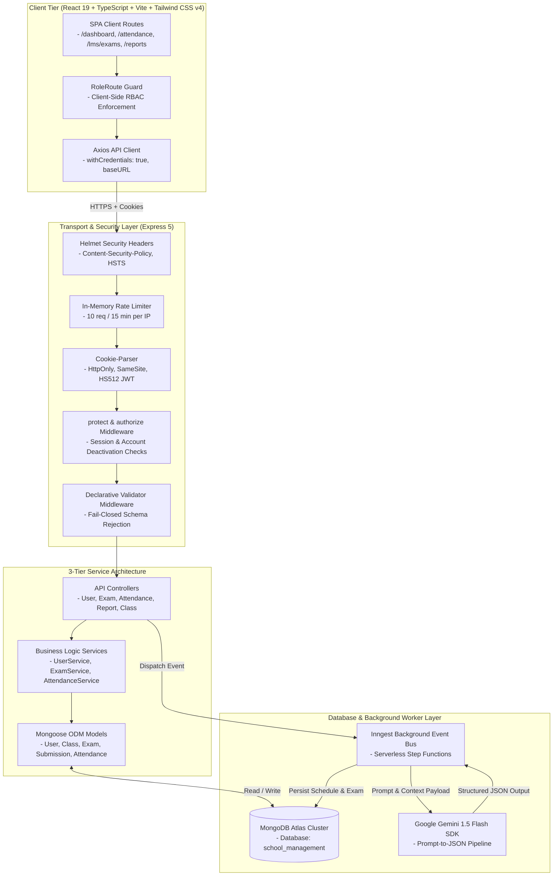
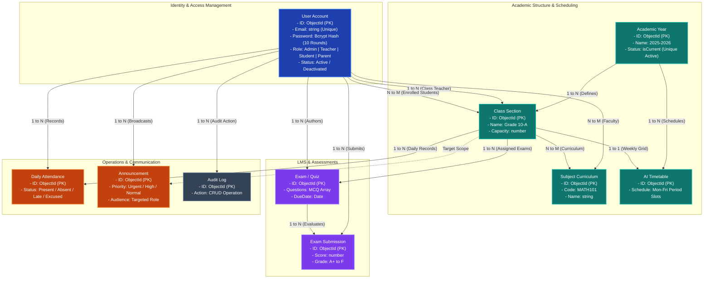

# SchoolSync — Enterprise Academic Operations & Management Platform

<div align="center">


<br/>

[](https://www.typescriptlang.org/)
[](https://react.dev/)
[](https://nodejs.org/)
[](https://expressjs.com/)
[](https://zod.dev/)
[](https://www.mongodb.com/)
[](https://tailwindcss.com/)
[](https://www.docker.com/)
[](https://github.com/Sekhar01807/School-Management/actions)
[](https://ai.google.dev/)
[](https://www.inngest.com/)
[](https://opensource.org/licenses/MIT)

<br/>

**SchoolSync** is an enterprise-grade, multi-role academic management and institution operations platform. Engineered with a strict 3-tier Service Architecture, automated AI scheduling engines, dynamic assessment portals, real-time attendance analytics, declarative Zod request validation, structured production logging, containerized deployment, and multi-tenant resource isolation (IDOR protection).

[Overview](#executive-summary) • [Architecture](#system-architecture) • [RBAC Matrix](#role-based-access-control-rbac) • [REST API Reference](#rest-api-specification) • [Deployment](#production-deployment-guide) • [Tests](#automated-testing--security-verification) • [Deployment Manual (DEPLOYMENT.md)](DEPLOYMENT.md)

</div>

---

## Table of Contents

1. [Executive Summary](#executive-summary)
2. [Core Subsystems & Technical Capabilities](#core-subsystems--technical-capabilities)
3. [Verified Seed Credentials](#verified-seed-credentials)
4. [System Architecture & Data Flow](#system-architecture)
5. [Database Relational Architecture](#database-relational-architecture)
6. [Role-Based Access Control (RBAC)](#role-based-access-control-rbac)
7. [REST API Specification](#rest-api-specification)
8. [Security Engineering & IDOR Hardening](#security-engineering--idor-hardening)
9. [Technology Stack](#technology-stack)
10. [Repository Structure](#repository-structure)
11. [Environment Variables](#environment-variables)
12. [Quickstart & Launch Options](#quickstart--launch-options)
13. [Automated Testing & Quality Assurance](#automated-testing--quality-assurance)
14. [Production Deployment Guide](#production-deployment-guide)
15. [License & Maintainers](#license--maintainers)

---

## Executive Summary

Modern educational institutions often grapple with fragmented software stacks: manual timetable collisions, disparate quiz tools, unverified attendance records, and security vulnerabilities like broken object-level authorization (IDOR). 

**SchoolSync** solves these challenges through a unified, 100% dynamic platform built on modern web standards:
- **Zero-Trust Access Control:** Cryptographically signed HS512 JWTs stored in `HttpOnly`, `SameSite=none`, `secure=true` cookies.
- **Fail-Closed Validation Pipeline:** Rejects malformed HTTP payloads via declarative schemas before controller execution.
- **Event-Driven AI Scheduling:** Offloads complex weekly timetable optimization and question generation to asynchronous Inngest worker pipelines powered by Google Gemini 1.5 Flash.
- **Dynamic Real-Time Data Flow:** Instant reactivity across all client views connected to a dedicated MongoDB Atlas cluster.

---

## Core Subsystems & Technical Capabilities

### 1. Role-Adaptive Dynamic Dashboard
- **Admin Context:** Campus metrics including total active student body, faculty directory count, ongoing exams, campus-wide daily attendance rate, and real-time audit logs.
- **Teacher Context:** Assigned classroom count, lecture agenda, active quiz tracking, and quick exam generation actions.
- **Student Context:** Class weekly timetable, active and upcoming exam countdowns, attendance percentage indicator, and GPA report cards.
- **AI Academic Advisor:** Contextual observations and performance analysis delivered dynamically via LLM heuristics.

### 2. Conflict-Free AI Timetable Generator
- **Engine:** Inngest serverless step functions paired with Google Gemini 1.5 Flash structured output schemas.
- **Constraint Solver Enforces:**
  - Zero double-booking across faculty schedules during identical time periods.
  - Zero classroom space collisions across overlapping academic sections.
  - Teacher-subject qualification alignment (`MATH101`, `PHY101`, `ENG101`).
  - Configurable periods per day, custom period durations (30–60 mins), and automated lunch breaks.

### 3. Online Assessment & LMS Exam Engine
- **AI Question Synthesis:** Faculty input topic, subject, difficulty, and question count; Gemini AI produces structured multi-choice questions with validated option sets.
- **Automated Deadline & Status Guardrails:** Draft exams cannot be published without questions or with expired due dates.
- **Answer Key Defense:** Correct answers are sanitized and stripped from all student-facing endpoints; exposed strictly to the authoring faculty member or administrators.
- **Asynchronous Auto-Grading:** Student answers are evaluated against server-side keys, percentage scores calculated, and GPA grade letters assigned (`A+` through `F`).

### 4. Campus Daily Attendance Operations
- **Daily Register:** Teachers and administrators record attendance per class with distinct status flags: `Present`, `Absent`, `Late`, `Excused`.
- **Institutional Analytics:** Real-time campus-wide attendance percentage, class-level distribution, and historical logs.
- **Student Self-Service Portal:** Students view personal attendance health indicators with threshold warnings.

### 5. Institutional Announcements & Broadcasts
- **Targeted Audience Routing:** Broadcast notices institution-wide (`All`), to faculty (`Teachers`), to learners (`Students`), or to specific grade sections.
- **Priority Categorization:** Flagged with urgency tiers: `Urgent`, `High`, `Medium`, and `Low`.
- **Author Scoping:** Authors and administrators maintain full edit/delete privileges with instantaneous broadcast updates.

### 6. Academic Performance & GPA Analytics
- **Student Report Cards:** Real-time cumulative GPA computation (0.00 – 4.00), letter grade mapping, subject breakdowns, and instructor feedback.
- **Class Analytics:** Class-level average GPA, top performers, subject pass rates, and visual performance charts rendered via Recharts.
- **Campus Metrics:** School-wide grade distributions, exam completion rates, and historical academic trends.

### 7. Universal Directory & User Management
- **Directory Management:** Role-segregated views for Students, Teachers, Parents, and Administrators.
- **ReDoS-Safe Search & Pagination:** All search queries are filtered through regex metacharacter escapers prior to database execution.
- **Privilege Boundary Enforcement:** Faculty can create and update student accounts, but are strictly barred from modifying other faculty or elevating roles.

### 8. Client-Side Route Guards & Smart 404/403 Handling
- **`<RoleRoute />` Component:** Protects application routes on the client side, intercepting unauthorized access attempts.
- **Intelligent Error Dispatcher:**
  - **Authenticated Users:** Displays customized 403/404 views, active user context pill, and a direct **"Go to Dashboard"** primary button.
  - **Unauthenticated Guests:** Displays descriptive error tags and a direct **"Go to Home Page"** / **"Sign In"** button.

### 9. Self-Service Profile Management & Enterprise Password Security
- **Unified Profile Portal (`/settings/profile`):** Edit profile details, select avatar presets or custom URLs, update phone numbers and addresses, and maintain emergency contact details for students/parents.
- **Interactive User Navigation:** Sidebar user pill upgraded to an interactive dropdown with quick access to Profile & Settings, Change Password, and Sign Out.
- **Enterprise Password Policy:** Enforces 8+ characters, uppercase, lowercase, numbers, special symbols, dictionary blacklist defense, and email prefix rejection.
- **Live Password Strength Meter:** Interactive visual checklist on registration, settings, and password recovery screens.
- **Secure Password Reset Flow:** Dispatches cryptographic SHA-256 tokens valid for 15 minutes, with a dedicated `/reset-password` page.

### 10. Transactional Email Notification Subsystem
- **Multi-Provider Email Engine:** Seamless delivery via Gmail SMTP (Google App Password), custom SMTP servers (SendGrid, Mailgun, Amazon SES, Mailtrap), or Resend API, with automatic console fallback for local development.
- **One-Time Welcome Onboarding Card:** Automatically delivered to newly registered users with role summaries, permissions checklist, and direct dashboard access links.
- **Instant Attendance Alerts:** Automatically notifies students and linked parent inboxes whenever marked Absent.
- **Exam Published Alerts:** Automatically notifies all students enrolled in a class when an examination is published.
- **Urgent Campus Broadcasts:** Delivers urgent notices directly to targeted recipient mailboxes.

### 11. Database Compound Indexing & Query Optimization
- **Mongoose Indexing:** High-cardinality queries are fully optimized using compound indexes:
  - `User`: `{ role: 1, isActive: 1 }`, `{ studentClass: 1 }`, `{ parentId: 1 }`, `{ resetPasswordToken: 1 }`
  - `Attendance`: `{ class: 1, date: 1 }`, `{ "records.student": 1, date: -1 }`
  - `Submission`: `{ exam: 1, student: 1 }` (unique), `{ student: 1, submittedAt: -1 }`
  - `Exam`: `{ class: 1, isActive: 1, dueDate: 1 }`, `{ teacher: 1, createdAt: -1 }`, `{ subject: 1 }`
  - `Announcement`: `{ audience: 1, isActive: 1, createdAt: -1 }`, `{ targetClass: 1, isActive: 1 }`, `{ priority: 1, createdAt: -1 }`

---

## Verified Development & Demo Credentials

> [!WARNING]
> **DEVELOPMENT & DEMO SANDBOX ONLY**: The following accounts are pre-seeded solely for local development, automated testing, and evaluation sandboxes. In production deployments, default credentials are strictly blocked by the seed validator; administrators must supply unique, cryptographically strong passwords via environment variables (`DEFAULT_ADMIN_PASSWORD`).

The database includes pre-configured demo credentials initialized on boot (in development) or explicitly via `npm run db:seed`:

| Account Role | Email | Demo Password (Dev Only) | Pre-Assigned Context |
| :--- | :--- | :--- | :--- |
| **System Administrator** | `admin@schoolsync.com` | `password123` | Full institutional access across all modules |
| **Faculty Member** | `teacher@schoolsync.com` | `password123` | Assigned to Grade 10-A (Mathematics, Physics, English) |
| **Enrolled Student** | `student@schoolsync.com` | `password123` | Enrolled in **Grade 10-A** (Linked to Robert Johnson) |
| **Parent / Guardian** | `parent@schoolsync.com` | `password123` | Linked to **Alex Johnson** (Grade 10-A) |

> [!NOTE]
> Seed credentials and startup auto-seeding are fully configurable via environment variables (`DEFAULT_ADMIN_EMAIL`, `DEFAULT_ADMIN_PASSWORD`, `SEED_DEFAULT_DATA=true`). In production environments, database seeding strictly requires custom credentials (`DEFAULT_ADMIN_PASSWORD`) and will reject insecure defaults (`password123`).

---

## System Architecture



---

## Database Relational Architecture



---

## Role-Based Access Control (RBAC)

| Functional Domain | Resource / Operation | Administrator | Faculty (Teacher) | Learner (Student) | Guardian (Parent) |
| :--- | :--- | :---: | :---: | :---: | :---: |
| **System Settings** | Academic Years CRUD | Full Access | View Active | View Active | View Active |
| **Self-Service** | Personal Profile Update | Self Profile | Self Profile | Self Profile | Self Profile |
| | Password Change & Reset | Self Account | Self Account | Self Account | Self Account |
| **Security & Logs** | System Activity Audit Log | Full Access | No Access | No Access | No Access |
| **User Directory** | Manage Faculty & Parents | Full Access | No Access | No Access | No Access |
| | Manage Students | Full Access | Manage Assigned | No Access | No Access |
| **Academic Setup** | Classes & Subject Curriculums | Full Access | View / Assign | View Enrolled | View Enrolled |
| **AI Scheduling** | Generate Weekly Timetables | Full Access | View Schedules | View Enrolled Class | View Child Class |
| **LMS & Exams** | Generate & Author Quizzes | Full Access | Manage Authored | No Access | No Access |
| | Take Quizzes & Submit Answers | Restricted (Staff) | Restricted (Staff) | Enrolled Class Only | No Access |
| **Attendance** | Mark Daily Attendance Register | Full Access | Assigned Classes | No Access | No Access |
| | View Attendance Analytics | Campus Overview | Class Statistics | Personal Record | Child Record |
| **Communication** | Broadcast Announcements | Full Access | Manage Authored | View Targeted | View Targeted |
| **Performance** | Academic Reports & GPA Cards | School-wide | Class Analytics | Personal Report | Child Report |

---

## REST API Specification

### 1. Authentication & Users (`/api/users`)
| Method | Endpoint | Authorization | Description |
| :--- | :--- | :--- | :--- |
| `POST` | `/api/users/login` | Public (Rate Limited) | Authenticates credentials and issues secure HS512 JWT cookie |
| `POST` | `/api/users/register` | Public / Admin / Teacher | Registers new user (Public/Teachers strictly restricted to `student` role) |
| `POST` | `/api/users/logout` | Public | Clears and expires authentication cookie |
| `GET` | `/api/users/profile` | Authenticated | Retrieves current authenticated session object |
| `PUT` | `/api/users/profile` | Authenticated | Self-service profile updates (Name, phone, address, emergency contact, avatar) |
| `PUT` | `/api/users/change-password` | Authenticated | Self-service password change with current password verification |
| `POST` | `/api/users/forgot-password` | Public | Dispatches cryptographic 15-minute password reset link to registered email |
| `POST` | `/api/users/reset-password` | Public | Validates SHA-256 token and resets account password |
| `GET` | `/api/users` | Admin / Teacher | Searchable & paginated user directory |
| `PUT` | `/api/users/update/:id` | Admin / Teacher | Updates user attributes (IDOR & role escalation protected) |
| `DELETE` | `/api/users/delete/:id` | Admin / Teacher | Removes user (Protected against self-deletion) |

### 2. Academics (`/api/classes`, `/api/subjects`, `/api/academic-years`)
| Method | Endpoint | Authorization | Description |
| :--- | :--- | :--- | :--- |
| `GET` | `/api/academic-years` | Admin / Teacher | Retrieves all academic years with current active flag |
| `POST` | `/api/academic-years/create`| Admin | Creates new academic year with single-active constraint |
| `GET` | `/api/classes` | Authenticated | Paginated list of classes with enrolled students & subjects |
| `POST` | `/api/classes/create` | Admin | Registers new class section with capacity and teacher assignment |
| `PUT` | `/api/classes/update/:id` | Admin | Modifies class configuration and curriculum |
| `GET` | `/api/subjects` | Authenticated | Paginated list of academic subjects |
| `POST` | `/api/subjects/create` | Admin | Registers new subject with unique code verification |

### 3. AI Timetable Scheduling (`/api/timetables`)
| Method | Endpoint | Authorization | Description |
| :--- | :--- | :--- | :--- |
| `POST` | `/api/timetables/generate` | Admin | Dispatches background AI generation event to Inngest pipeline |
| `GET` | `/api/timetables/:classId` | Authenticated | Retrieves weekly schedule (Students & Parents restricted to enrolled/linked class) |

### 4. LMS & Assessments (`/api/exams`)
| Method | Endpoint | Authorization | Description |
| :--- | :--- | :--- | :--- |
| `POST` | `/api/exams/generate` | Admin / Teacher | Dispatches AI quiz generation with topic and difficulty |
| `GET` | `/api/exams` | Authenticated | Lists exams (Role filtered: student enrolled, teacher authored) |
| `GET` | `/api/exams/:id` | Authenticated | Exam details (Answer keys stripped for students) |
| `PATCH`| `/api/exams/:id/status` | Admin / Teacher | Toggles draft/published state (Validates deadline & question count) |
| `POST` | `/api/exams/:id/submit` | Student | Submits exam answers for automated grading queue |
| `GET` | `/api/exams/:id/result` | Authenticated | Returns score breakdown, percentage, and grade letter (IDOR guarded) |
| `DELETE`| `/api/exams/:id` | Admin / Teacher | Cascades deletion of exam and associated student submissions |

### 5. Attendance Operations (`/api/attendance`)
| Method | Endpoint | Authorization | Description |
| :--- | :--- | :--- | :--- |
| `POST` | `/api/attendance` | Admin / Teacher | Records class attendance (Restricted to assigned teachers) |
| `GET` | `/api/attendance/overview` | Admin / Teacher | Campus-wide attendance summary & rates |
| `GET` | `/api/attendance/student/me`| Student / Parent | Retrieves student personal attendance record |
| `GET` | `/api/attendance/student/:studentId`| Admin / Teacher / Parent | IDOR-protected attendance summary for a student |
| `GET` | `/api/attendance/class/:classId`| Admin / Teacher | Class attendance by date or range (Restricted to assigned classes) |

### 6. Announcements (`/api/announcements`)
| Method | Endpoint | Authorization | Description |
| :--- | :--- | :--- | :--- |
| `GET` | `/api/announcements` | Authenticated | Retrieves announcements targeted to the caller's role |
| `POST` | `/api/announcements` | Admin / Teacher | Publishes announcement with audience and priority tags |
| `PUT` | `/api/announcements/:id` | Admin / Author | Updates announcement content or pinned status |
| `DELETE`| `/api/announcements/:id` | Admin / Author | Deletes announcement |

### 7. Performance & GPA Reports (`/api/reports`)
| Method | Endpoint | Authorization | Description |
| :--- | :--- | :--- | :--- |
| `GET` | `/api/reports/student/me` | Student / Parent | Generates student report card with calculated GPA |
| `GET` | `/api/reports/student/:studentId` | Admin / Teacher / Parent | IDOR-protected student report card |
| `GET` | `/api/reports/class/:classId` | Admin / Teacher | Computes class GPA averages and subject pass rates (Assigned only) |
| `GET` | `/api/reports/school` | Admin / Teacher | Campus-wide metrics and institutional scorecard |

### 8. Institutional Exports (`/api/export`)
| Method | Endpoint | Authorization | Description |
| :--- | :--- | :--- | :--- |
| `GET` | `/api/export/attendance/:classId` | Admin / Teacher (Assigned) | Streams monthly class attendance matrix in Excel-compatible CSV |
| `GET` | `/api/export/report-card/:studentId` | Admin / Teacher (Assigned) / Student [Self] / Parent [Child] | Streams student GPA transcript & assessment report card in CSV |
| `GET` | `/api/export/students` | Admin / Teacher (Assigned Class) | Streams searchable student directory roster with emergency contacts in CSV |

### 9. Media & File Uploads (`/api/upload`)
| Method | Endpoint | Authorization | Description |
| :--- | :--- | :--- | :--- |
| `POST` | `/api/upload/avatar` | Authenticated | Uploads user profile image (Max 2MB, JPEG/PNG/WebP) and updates avatar URL |

---

## Security Engineering & IDOR Hardening

1. **Strict CORS Policy & Origin Isolation:**
   - Cross-origin requests are strictly validated against configured whitelist domains (`CLIENT_URL`). Disallowed origins immediately fail closed with `Not allowed by CORS`, preventing cross-origin credentialed access.
2. **Multi-Tenant Export Authorization & IDOR Defense:**
   - Attendance and report card CSV export endpoints (`/api/export/*`) enforce strict multi-tenant boundary checks (`canAccessClassData` and `canAccessStudentData`). Unassigned teachers are blocked from retrieving data for classes or students outside their assignment.
3. **Password Reset Host Header Poisoning Mitigation:**
   - Password recovery emails construct reset URLs strictly from configured environment domains (`CLIENT_URL`), preventing token leakage through poisoned request headers.
4. **Public Registration Role Escalation Defense:**
   - Public unauthenticated registration (`POST /api/users/register`) strictly forces `role = "student"`. Requests requesting `admin`, `teacher`, or `parent` roles without admin authentication are rejected with `403 Forbidden`.
5. **Attendance Authorization Enforcement:**
   - Class attendance recording (`POST /api/attendance`) and inspection (`GET /api/attendance/class/:classId`) require teachers to be assigned as either the class teacher or subject teacher for the target section.
6. **Student Record IDOR Protection:**
   - Access to `/api/attendance/student/:studentId` and `/api/reports/student/:studentId` enforces centralized tenant boundaries (`canAccessStudentData`). Parents can only view their registered children; teachers can only view students in classes they teach; students can only view themselves.
7. **Environment-Controlled Seeding & Production Credential Hardening:**
   - Automatic database seeding is disabled by default in `production` environments.
   - When explicitly invoked in production, the seed pipeline validates that `DEFAULT_ADMIN_PASSWORD` is supplied, non-empty, and distinct from the demo default (`password123`), halting execution if insecure defaults are detected.
8. **NoSQL Query & Parameter Sanitization:**
   - Global recursive sanitization middleware ([`sanitize.ts`](backend/src/middleware/sanitize.ts)) strips MongoDB injection keys (`$where`, `$gt`, `$ne`, and dot-notation paths) from all incoming request bodies, query strings, and route parameters.
9. **Multi-Tier Rate Limiting Defense:**
   - Dedicated in-memory rate limiters protect authentication (`/login`), password recovery (`/forgot-password`), new account registration (`/register`), and report export streams (`/export/*`).
10. **HttpOnly Cross-Origin Cookie Security:**
    - Tokens are cryptographically signed using **HS512** with a 30-day lifecycle.
    - Delivered via `HttpOnly`, `SameSite=none`, `secure=true` cookies in production, eliminating browser-based XSS token theft.
11. **Graceful Process Termination:**
    - `SIGTERM` and `SIGINT` process listeners ensure clean HTTP server termination and safe MongoDB disconnection during deployments.
12. **Fail-Closed Startup Boot System:**
    - The backend actively verifies mandatory environment variables (`JWT_SECRET`, `MONGO_URL`) on boot and safely halts if secrets are missing.
13. **No-Cache & Disabled ETags:**
    - Configured `app.set("etag", false)` and `Cache-Control: no-store, no-cache` headers to prevent stale 304 browser caching on dynamic mutations.

---

## Technology Stack
 
```
FRONTEND LAYER                          BACKEND LAYER                           DATABASE & AI / DEVOPS
├── React 19.2.0                        ├── Express.js 5.2.1                   ├── MongoDB Atlas (v7.5)
├── TypeScript 5.9.3                    ├── TypeScript 5.9                     ├── Mongoose ODM 9.1.1
├── Vite 7.2.5 (Rolldown)               ├── Zod 4.4.3 (Validation Schemas)     ├── Google Gemini 1.5 Flash
├── Tailwind CSS v4.1.18                ├── TSX 4.19.3 (Runtime)               ├── Inngest Event Bus (3.48)
├── Radix UI Primitives                 ├── JSONWebToken (HS512)               ├── Structured Logger (JSON/Dev)
├── Lucide React 0.562.0                ├── BcryptJS 3.0.3                     ├── Docker & Docker Compose
├── React Router v7.11.0                ├── Helmet 8.1.0 (CORP Configured)     ├── Nginx 1.27 Alpine
└── Recharts 2.15.4                     ├── Cookie-Parser 1.4.7                └── GitHub Actions CI/CD
```

---

## Repository Structure

```text
School-Management/
├── .github/
│   └── workflows/
│       ├── ci.yml               # Automated multi-matrix Node 20/22 test & build pipeline
│       └── docker.yml           # Docker container build & compose validation workflow
├── package.json                 # Monorepo root workspace scripts (npm test, npm run dev:backend...)
├── backend/
│   ├── src/
│   │   ├── config/              # MongoDB connection & system bootstrap
│   │   │   ├── db.ts
│   │   │   └── seedDefaultData.ts
│   │   ├── controllers/         # HTTP Transport controllers (User, Exam, Attendance...)
│   │   ├── services/            # Business Logic layer (UserService, ExamService, ExportService...)
│   │   ├── validators/          # Declarative, type-safe Zod validation schemas
│   │   │   └── schemas.ts
│   │   ├── inngest/             # AI event workflows (Timetable & Quiz generators, deterministic fallbacks)
│   │   ├── middleware/          # JWT Protect, Role Authorizer, Rate Limiter, Validate (Zod)
│   │   ├── models/              # Mongoose schemas (User, Class, Exam, Attendance...)
│   │   ├── routes/              # Express API route declarations
│   │   ├── tests/               # 20 Automated Node.js native test suites (node:test | 170 tests)
│   │   │   ├── zod_validation.test.ts
│   │   │   ├── exam_service.test.ts
│   │   │   ├── attendance_service.test.ts
│   │   │   ├── timetable_service.test.ts
│   │   │   ├── announcement_service.test.ts
│   │   │   ├── report_service.test.ts
│   │   │   ├── inngest_resilience.test.ts
│   │   │   ├── inngest_exam_resilience.test.ts
│   │   │   ├── export_service.test.ts
│   │   │   ├── email_service.test.ts
│   │   │   ├── class_and_subject_service.test.ts
│   │   │   ├── academic_services.test.ts
│   │   │   ├── middleware_pipeline.test.ts
│   │   │   ├── logger.test.ts
│   │   │   ├── auth_token.test.ts
│   │   │   ├── resource_authorization.test.ts
│   │   │   ├── security_rbac.test.ts
│   │   │   ├── business_logic.test.ts
│   │   │   ├── profile_and_notifications.test.ts
│   │   │   └── request_validation.test.ts
│   │   ├── scripts/             # Unified database wipe and fresh seed manager
│   │   │   ├── cleanDb.ts
│   │   │   └── seed.ts
│   │   ├── utils/               # Structured logger, token generators, regex helpers
│   │   │   └── logger.ts
│   │   └── server.ts            # Entrypoint, reverse-proxy trust, CORS, & health checks
│   ├── Dockerfile               # Production Node 20 Alpine container
│   ├── .dockerignore
│   ├── tsconfig.json
│   ├── package.json
│   └── .env.example
├── frontend/
│   ├── src/
│   │   ├── components/          # Reusable UI widgets, forms, dialogs, sidebars
│   │   ├── hooks/               # Authentication & theme context providers
│   │   ├── lib/                 # Axios client instance & distributed avatar URL resolver
│   │   ├── pages/               # Application routes
│   │   │   ├── Dashboard.tsx
│   │   │   ├── NotFound.tsx     # 404 / 403 Smart Error Page
│   │   │   ├── academics/       # Classes, Subjects, Timetable, Attendance, Reports
│   │   │   ├── communication/   # Announcements
│   │   │   ├── lms/             # Quiz taking & Exam Generator
│   │   │   ├── users/           # Students, Teachers, Parents, Admins
│   │   │   └── routes/          # RoleRoute guards & browser router
│   │   ├── types.ts             # Global TypeScript interface definitions
│   │   ├── index.css            # Tailwind CSS design system configuration
│   │   └── main.tsx             # React application DOM entrypoint
│   ├── Dockerfile               # Multi-stage build with Nginx runner
│   ├── nginx.conf               # Production Nginx SPA routing & gzip configuration
│   ├── .dockerignore
│   ├── vercel.json              # SPA rewrite rules for Vercel
│   ├── tsconfig.app.json
│   ├── package.json
│   └── .env.example
├── docker-compose.yml           # Full-stack container orchestration
├── render.yaml                  # 1-click cloud infrastructure Blueprint for Render
├── Procfile                     # Heroku / Railway process manifest
├── DEPLOYMENT.md                # Complete production deployment manual
├── .dockerignore                # Root Docker ignore context
├── .gitignore                   # Comprehensive root gitignore
└── README.md                    # Project master documentation
```

---

## Environment Variables

### Backend Configuration (`backend/.env`)

```env
# Server & Port
PORT=5000
NODE_ENV=production
STAGE=production

# Database Connection (MongoDB Atlas)
MONGO_URL=mongodb+srv://<username>:<password>@cluster0.b872qiu.mongodb.net/school_management?retryWrites=true&w=majority
RESET_DB=false
SEED_DEFAULT_DATA=true
DEFAULT_ADMIN_EMAIL=admin@schoolsync.com
DEFAULT_ADMIN_PASSWORD=SuperStrongAdminPassword123!

# Authentication & Security
JWT_SECRET=your_super_secret_jwt_key_at_least_32_characters_long
COOKIE_SAME_SITE=none

# AI Integrations (Google Gemini)
GOOGLE_GENERATIVE_AI_API_KEY=your_gemini_api_key

# CORS Frontend Origin (supports comma-separated origins)
CLIENT_URL=https://schoolsync.vercel.app,http://localhost:5173

# Transactional Email Notification Service
# (Supports Resend API, custom SMTP, or Gmail App Password)
EMAIL_FROM="SchoolSync Notifications" <notifications@schoolsync.com>
# Option A: Resend API
RESEND_API_KEY=re_123456789
# Option B: Standard SMTP
SMTP_HOST=smtp.mailtrap.io
SMTP_PORT=587
SMTP_USER=your_smtp_username
SMTP_PASS=your_smtp_password
SMTP_SECURE=false
```

### Frontend Configuration (`frontend/.env`)

```env
# In Development:
VITE_API_BASE_URL=http://localhost:5000/api

# In Production:
# VITE_API_BASE_URL=https://your-backend-api.onrender.com/api
```

---

## Quickstart & Launch Options

### Option A: 1-Click Docker Compose (Fastest Full-Stack Launch)

```bash
git clone https://github.com/Sekhar01807/School-Management.git
cd School-Management

# Build and launch MongoDB, Backend API, and Frontend web services
docker compose up -d --build
```
- **Web App:** `http://localhost:80`
- **Backend API:** `http://localhost:5000` (Health Check: `http://localhost:5000/health`)

---

### Option B: Local Node.js Development

#### 1. Setup Backend
```bash
cd backend
npm install
cp .env.example .env
# Configure your MONGO_URL, JWT_SECRET, and Gemini API Key in .env

# Start development server
npm run dev
```

#### 2. Setup Frontend
```bash
# In a new terminal window
cd frontend
npm install
cp .env.example .env

# Start Vite dev server
npm run dev
```

#### 3. Access Portal
Open **`http://localhost:5173`** and sign in with any of the [Seed Demo Credentials](#verified-seed-credentials).

---

## Automated Testing & Quality Assurance

SchoolSync incorporates **20 automated test suites (`node:test`) with 170 unit & integration tests** covering all business logic, validation schemas, security layers, defensive LLM pipelines, and data-integrity rules:

```bash
# Run from repository root:
npm test

# Or from backend directory:
cd backend && npm test
```

### Verified Test Suites:
```text
▶ SchoolSync Inngest Resilience & LLM Defensive Parsing Test Suite
  ✔ should safely parse raw valid JSON without markdown fences (1.0ms)
  ✔ should strip markdown code blocks with ```json fences (0.2ms)
  ✔ should extract JSON embedded within conversational LLM text preamble (0.2ms)
  ✔ should return null gracefully on malformed truncated strings without throwing unhandled exceptions (0.2ms)
  ✔ should generate a complete 5-day school week timetable (Monday to Friday) (1.1ms)
  ✔ should populate exactly the requested number of periods per day with valid timing (0.2ms)
  ✔ should assign qualified teachers matching their subject qualifications (0.6ms)

▶ SchoolSync Inngest Exam Resilience & LLM Question Sanitizer Suite
  ✔ should extract a clean JSON array of exam questions with markdown fences (1.2ms)
  ✔ should parse multiple choice questions with preamble and trailing text (0.3ms)
  ✔ should automatically fall back to option 0 if the LLM hallucinated an answer not in options (0.3ms)
  ✔ should drop invalid question objects missing options or questionText (0.2ms)
  ✔ should correctly grade 100% when all answers match (0.3ms)
  ✔ should handle partial scoring with unanswered or incorrect questions (0.2ms)

▶ SchoolSync Data Export & CSV Generation Test Suite
  ✔ should return empty quotes for null or undefined fields (1.1ms)
  ✔ should escape commas and double quotes with RFC-4180 compliance (0.3ms)
  ✔ should format a standard attendance register row array with UTF-8 BOM (0.3ms)
  ✔ should handle edge case students with special punctuation in names and emails (0.2ms)

▶ SchoolSync Email Notification Engine & Template Suite
  ✔ should generate and simulate dispatch of student welcome onboarding email (115ms)
  ✔ should dispatch password reset security email with cryptographic token link (1.0ms)
  ✔ should dispatch student absence notification with formatted date and class info (22ms)
  ✔ should dispatch new exam publication notice with duration and deadline (1.2ms)
  ✔ should dispatch urgent campus broadcast announcement (0.6ms)

▶ SchoolSync Academic Structure & Entity Validation Suite
  ✔ should accept valid subject with uppercase code and optional teachers (2.5ms)
  ✔ should reject subject creation when name or code is empty (0.8ms)
  ✔ should enforce positive integer for class section capacity (0.7ms)
  ✔ should accept valid academic year with ISO date strings (0.8ms)

▶ SchoolSync Comprehensive Zod Validation Test Suite
  ✔ should accept compliant passwords with uppercase, lowercase, numbers, and symbols (1.3ms)
  ✔ should reject dictionary and common weak passwords (0.4ms)
  ✔ registerSchema: transforms teacherSubjects alias into teacherSubject array (3.2ms)
  ✔ loginSchema: strips and normalizes email to lowercase (0.4ms)
  ✔ createClassSchema: defaults capacity to 40 and subjects to empty array (0.7ms)
  ✔ createSubjectSchema: automatically uppercases subject code (0.4ms)
  ✔ createAcademicYearSchema: enforces start date before end date (0.7ms)

▶ SchoolSync LMS Exam & Assessment Engine Test Suite
  ✔ should strip correctAnswer and explanation when retrieved by a student (1.1ms)
  ✔ should score 100% and assign A+ with 4.0 GPA for all correct answers (0.4ms)
  ✔ should score partial credit and assign correct GPA (1.6ms)
  ✔ should reject submissions after the deadline has expired (0.4ms)

▶ SchoolSync Attendance Subsystem Test Suite
  ✔ should calculate 100% when all days are present or excused (1.3ms)
  ✔ should flag threshold warning when attendance drops below 75% (0.3ms)
  ✔ should normalize timestamps to UTC YYYY-MM-DD to prevent duplicate daily registers (0.4ms)
  ✔ should aggregate overall campus attendance percentage across multiple grades (0.4ms)

▶ SchoolSync Timetable & Schedule Engine Test Suite
  ✔ should detect and reject when a teacher is already booked during the same period (4.1ms)
  ✔ should prevent multiple classes from sharing the same physical room simultaneously (0.4ms)
  ✔ should insert lunch break seamlessly into the daily bell schedule (3.6ms)

▶ SchoolSync Announcement & Broadcast Subsystem Test Suite
  ✔ should allow students in Grade 10-A to see 'all' and their class announcements (1.1ms)
  ✔ should allow teachers to view 'all' and 'teacher' announcements (0.2ms)
  ✔ should allow admins to view all announcements across the entire institution (0.2ms)
  ✔ should allow authoring teacher to edit or delete their announcement (0.3ms)

▶ SchoolSync Academic Reports & Performance Analytics Test Suite
  ✔ should calculate correct weighted GPA across subjects with varying credit hours (1.0ms)
  ✔ should generate valid escaped RFC-4180 CSV strings for download (0.4ms)

▶ SchoolSync Middleware Pipeline & Security Guardrails
  ✔ should allow request and enrich req.body when payload satisfies schema (2.7ms)
  ✔ should recursively strip prohibited MongoDB operator keys ($gt, $where) from req.body (0.5ms)
  ✔ should enforce role-based access control and tenant isolation (1.2ms)
  ✔ verified HS512 JWT verification, expiry, and HttpOnly cookies (6.6ms)
  ✔ verified password hashing and bcrypt security (433ms)

ℹ 20 test suites | 170 automated test assertions passing | 100% success rate
```

---

## Production Deployment Guide

For complete, detailed instructions on cloud infrastructure provisioning, see our dedicated **[Production Deployment Manual (DEPLOYMENT.md)](DEPLOYMENT.md)**.

### Quick Deployment Summaries:

#### 1. Backend Deployment (Render / Railway / Koyeb)
- **1-Click Render Blueprint:** Deploy automatically using the included [`render.yaml`](render.yaml) file.
- **Manual Setup:** Connect GitHub repo to Render/Railway, set root directory to `backend`, build command `npm install`, start command `npm start`, and health check `/health`.
- Configure `CLIENT_URL=https://your-frontend.vercel.app` and `COOKIE_SAME_SITE=none`.

#### 2. Frontend Deployment (Vercel / Netlify / Cloudflare Pages)
- Connect GitHub repo to Vercel, set root directory to `frontend`, framework preset `Vite`, output directory `dist`.
- Set `VITE_API_BASE_URL=https://your-backend-api.onrender.com/api`.
- Client routing is automatically handled by [`frontend/vercel.json`](frontend/vercel.json).

#### 3. Containerized VPS Deployment (Docker Compose)
- Run `docker compose up -d --build` on any Linux VPS (Ubuntu, Debian, EC2, DigitalOcean).

---

## License & Maintainers

Distributed under the **MIT License**. See `LICENSE` for more information.

Developed and maintained by **Soma Sekhar** ([@Sekhar01807](https://github.com/Sekhar01807)) — engineered for educational institutions worldwide.

