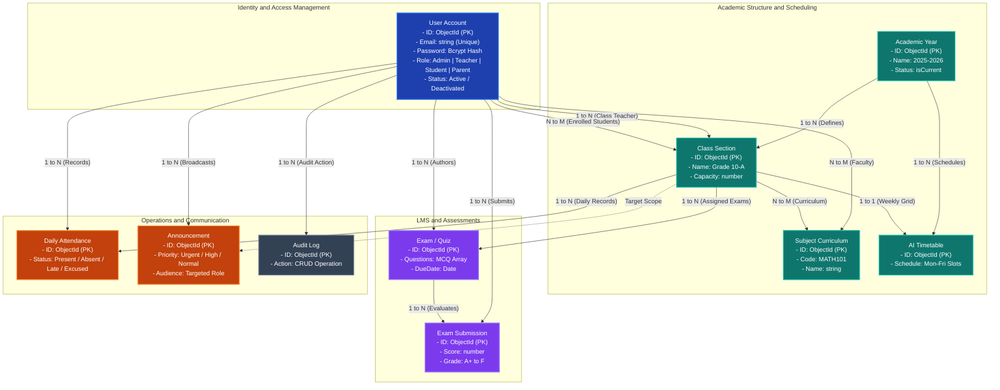

# 🎓 SchoolSync — Enterprise Multi-Role Academic Management & Operations Platform

<div align="center">


<br/>

[](https://www.typescriptlang.org/)
[](https://react.dev/)
[](https://nodejs.org/)
[](https://expressjs.com/)
[](https://www.mongodb.com/)
[](https://tailwindcss.com/)
[](https://ai.google.dev/)
[](https://www.inngest.com/)
[](https://opensource.org/licenses/MIT)

<br/>

<p align="center">
  <b>An enterprise-ready, role-based educational management and academic operations platform engineered with a strict 3-tier Service Architecture, automated AI scheduling, online testing engines, daily attendance analytics, and multi-tenant IDOR security boundaries.</b>
</p>

[Explore Features](#-core-subsystems--features) • [System Architecture](#-system-architecture) • [RBAC Matrix](#-role-based-access-control-rbac-matrix) • [REST API Docs](#-rest-api-specification) • [Deployment](#-production-deployment-guide) • [Tests](#-automated-testing--benchmarks)

</div>

---

## 📑 Table of Contents

- [📌 Executive Overview](#-executive-overview)
- [✨ Core Subsystems & Features](#-core-subsystems--features)
  - [1. Role-Adaptive Dynamic Dashboard](#1--role-adaptive-dynamic-dashboard)
  - [2. Conflict-Free AI Timetable Generator](#2--conflict-free-ai-timetable-generator)
  - [3. AI Assessment & LMS Exam Engine](#3--ai-assessment--lms-exam-engine)
  - [4. Campus Attendance Operations](#4--campus-attendance-operations)
  - [5. Institutional Announcements & Broadcasts](#5--institutional-announcements--broadcasts)
  - [6. Academic Performance & GPA Report Cards](#6--academic-performance--gpa-report-cards)
  - [7. Universal People Directory & Management](#7--universal-people-directory--management)
  - [8. Client-Side Route Guards & Smart 404/403 Pages](#8-️-client-side-route-guards--smart-404403-pages)
- [🔑 Seed Demo Credentials](#-seed-demo-credentials)
- [🏗️ System Architecture & Data Flow](#-system-architecture--data-flow)
- [🗄️ Database Relational Architecture Diagram](#️-database-relational-architecture-diagram)
- [👥 Role-Based Access Control (RBAC) Matrix](#-role-based-access-control-rbac-matrix)
- [📡 REST API Specification](#-rest-api-specification)
- [🔒 Security & Engineering Hardening](#-security--engineering-hardening)
- [🛠️ Tech Stack & Dependencies](#️-tech-stack--dependencies)
- [📁 Repository Structure](#-repository-structure)
- [⚙️ Environment Configuration](#️-environment-configuration)
- [🚀 Local Development Quickstart](#-local-development-quickstart)
- [🧪 Automated Testing & Benchmarks](#-automated-testing--benchmarks)
- [🌐 Production Deployment Guide](#-production-deployment-guide)
  - [Backend Deployment (Render / Railway)](#1-backend-deployment-render--railway)
  - [Frontend Deployment (Vercel / Netlify)](#2-frontend-deployment-vercel--netlify)
- [📄 License & Authors](#-license--authors)

---

## 📌 Executive Overview

**SchoolSync** is designed from the ground up to solve the real-world operational complexities of schools, colleges, and academic institutions. Rather than relying on static prototypes or fragmented spreadsheets, SchoolSync provides a unified, **100% dynamic**, and secure platform that links students, faculty, administrators, and parents in real time.

```
┌──────────────────────────────────────────────────────────────────────────────────────────────────┐
│                                    SCHOOLSYNC CORE GUARANTEES                                    │
├──────────────────────────┬──────────────────────────┬──────────────────────────┬─────────────────┤
│ 🛡️ Zero-Trust Security   │ ⚡ Event-Driven AI Workflows│ 📊 100% Dynamic Engine   │ 📈 Real-Time KPI│
│   • HS512 JWT Cookies    │   • Google Gemini Flash  │   • Live MongoDB Atlas   │   • GPA & Rank  │
│   • IDOR Exam Isolation  │   • Inngest Event Bus    │   • Zero Static Mocks    │   • Attendance %│
│   • Anti-ReDoS Escaping  │   • Automatic Rescheduling│  • Reactive State Flow  │   • Recharts UI │
└──────────────────────────┴──────────────────────────┴──────────────────────────┴─────────────────┘
```

---

## ✨ Core Subsystems & Features

### 1. 📊 Role-Adaptive Dynamic Dashboard
- **Administrator View:** High-level institutional KPIs: total active students, registered faculty, total classes, campus attendance rates, ongoing quizzes, and system audit logs.
- **Teacher View:** Assigned class count, student submission grading queues, daily lecture agenda, and one-click quiz generators.
- **Student View:** Enrolled class timetable, pending examination countdowns, attendance health score, and personal GPA progress cards.
- **Live AI Insight Advisor:** Real-time heuristic performance summaries delivering actionable academic observations.

### 2. ⚡ Conflict-Free AI Timetable Generator
- **Algorithm:** Inngest serverless job paired with Google Gemini 1.5 Flash structured outputs.
- **Strict Constraints Enforced:**
  - Zero double-booking for teachers across different classes during the same period.
  - Zero classroom space collisions.
  - Automatic qualification mapping: Teachers are strictly assigned to periods matching their designated subject codes (`MATH101`, `PHY101`, etc.).
  - Configurable daily start/end hours, custom period durations (30–60 mins), and lunch intervals.

### 3. 📝 AI Assessment & LMS Exam Engine
- **Prompt-to-Quiz Generation:** Teachers supply topic, subject, difficulty, and question count; Gemini AI builds structured multi-choice questions with validated option sets.
- **Automated Deadline Guardrails:** Draft exams cannot be published without questions or with past due dates.
- **Answer Key Defense:** Correct answer keys are strictly sanitized from student payloads and only exposed to authoring teachers or admins.
- **Automated Grading Engine:** Submissions are automatically evaluated, percentage scores calculated, and letter grades assigned (`A+` to `F`).

### 4. 📋 Campus Attendance Operations
- **Daily Attendance Marking:** Batch marking interface for teachers/admins with status tags: `Present`, `Absent`, `Late`, `Excused`.
- **Campus Analytics:** Aggregate daily attendance percentage, department-level distribution, and historical class summaries.
- **Student Self-Service Portal:** Students monitor their individual attendance percentage with status indicators and warning alerts when falling below attendance thresholds.

### 5. 📢 Institutional Announcements & Broadcasts
- **Targeted Audience Routing:** Publish notices to `All Campus`, `Faculty Only`, `Students Only`, or specific `Class / Grade`.
- **Visual Priority Badges:** Categorized by urgency: `Urgent`, `High`, `Medium`, `Low`.
- **Author Permissions:** Authors and administrators maintain full edit/delete privileges with instantaneous UI broadcast.

### 6. 📈 Academic Performance & GPA Report Cards
- **Student Report Cards:** Aggregates real examination scores, computes weighted cumulative GPA (0.00 – 4.00), displays letter grade breakdowns, subject remarks, and class teacher feedback.
- **Class Analytics:** Class-level average GPA, top performers, subject pass rates, and interactive visual charts rendered via Recharts.
- **School-Wide Analytics:** Campus-wide average grades, examination completion rates, and historical academic trends.

### 7. 👥 Universal People Directory & Management
- **Directory Portals:** Dedicated management tables for `Students`, `Teachers`, `Parents`, and `Administrators`.
- **Live Search & Pagination:** Debounced search queries sanitized through regex escapers to prevent ReDoS, paired with server-side pagination.
- **Privilege Boundary Enforcement:** Teachers can create and update student accounts, but are strictly blocked from editing faculty or elevating permissions.

### 8. 🛡️ Client-Side Route Guards & Smart 404/403 Pages
- **`<RoleRoute />` Wrapper:** Transparently intercepts unauthorized role navigation and prevents broken UI states.
- **Intelligent Error Dispatcher:**
  - **Authenticated Users:** Displays customized 403/404 messages, user profile pill, and a direct **"Back to Dashboard"** primary button.
  - **Unauthenticated Guests:** Displays descriptive error tags and a direct **"Go to Home Page"** / **"Sign In"** button.

---

## 🔑 Seed Demo Credentials

When the system boots or is reset via `npm run db:clean`, the following verified accounts are available for testing:

| Role | Email | Password | Pre-Assigned Context |
| :--- | :--- | :--- | :--- |
| **👑 Admin** | `admin@schoolsync.com` | `password123` | Full institutional access across all modules |
| **👨‍🏫 Teacher** | `teacher@schoolsync.com` | `password123` | Assigned to Grade 10-A (Math, Physics, Literature) |
| **🎓 Student** | `student@schoolsync.com` | `password123` | Enrolled in **Grade 10-A** |

---

## 🏗️ System Architecture & Data Flow


---

## 🗄️ Database Relational Architecture Diagram



---

## 👥 Role-Based Access Control (RBAC) Matrix

| Module / Action | 👑 Admin | 👨‍🏫 Teacher | 🎓 Student | 👨‍👩‍👧 Parent |
| :--- | :---: | :---: | :---: | :---: |
| **System Settings (Academic Years)** | Full CRUD | View Active | View Active | View Active |
| **Activity Audit Logs (`ActivitiesLog`)** | View All | ❌ Forbidden | ❌ Forbidden | ❌ Forbidden |
| **Faculty & Parent Directory Management** | Full CRUD | ❌ Forbidden | ❌ Forbidden | ❌ Forbidden |
| **Student Directory Management** | Full CRUD | Manage Assigned | ❌ Forbidden | ❌ Forbidden |
| **Classes & Subject Curriculum** | Full CRUD | View & Assign | View Enrolled | View Enrolled |
| **AI Timetable Generator** | Trigger & Edit | View Schedules | View Enrolled Class | View Child Class |
| **AI Exam / Quiz Generator** | Full Access | Author & Manage Own | ❌ Forbidden | ❌ Forbidden |
| **Take Quizzes & Submit Answers** | ❌ (Staff) | ❌ (Staff) | Take & Submit | ❌ Forbidden |
| **Mark Daily Attendance** | Campus-wide | Assigned Classes | ❌ Forbidden | ❌ Forbidden |
| **View Attendance Records** | Campus Overview | Class Statistics | Personal Records | Child Records |
| **Create & Broadcast Announcements** | All Audiences | Class & Students | 👁️ View Targeted | 👁️ View Targeted |
| **Academic Reports & GPA Analytics** | School-wide | Class Analytics | Personal Report Card | Child Report Card |

---

## 📡 REST API Specification

### 1. Authentication & Session (`/api/users`)
| Method | Endpoint | Authorization | Description |
| :--- | :--- | :--- | :--- |
| `POST` | `/api/users/login` | Public (Rate Limited) | Authenticates credentials and sets secure HS512 JWT cookie |
| `POST` | `/api/users/register` | Admin / Teacher | Registers new user (Teachers restricted to `student` role) |
| `POST` | `/api/users/logout` | Public | Invalidates and expires session cookie |
| `GET` | `/api/users/profile` | Authenticated | Retrieves current user session object |
| `GET` | `/api/users` | Admin / Teacher | Searchable & paginated user directory |
| `PUT` | `/api/users/update/:id` | Admin / Teacher | Updates user attributes (IDOR protected) |
| `DELETE` | `/api/users/delete/:id` | Admin / Teacher | Deletes user account (Protected against self-deletion) |

### 2. Academics (`/api/classes`, `/api/subjects`, `/api/academic-years`)
| Method | Endpoint | Authorization | Description |
| :--- | :--- | :--- | :--- |
| `GET` | `/api/academic-years` | Admin / Teacher | Lists academic years with current active flag |
| `POST` | `/api/academic-years/create`| Admin | Creates new academic year with single-active constraint |
| `GET` | `/api/classes` | Admin / Teacher | Paginated list of classes, enrolled students, and subjects |
| `POST` | `/api/classes/create` | Admin | Registers new class section with teacher assignment |
| `PUT` | `/api/classes/update/:id` | Admin | Updates class capacity and curriculum |
| `GET` | `/api/subjects` | Admin / Teacher | Lists all subjects and assigned faculty |
| `POST` | `/api/subjects/create` | Admin | Creates new subject with unique code verification |

### 3. AI Timetable Scheduling (`/api/timetables`)
| Method | Endpoint | Authorization | Description |
| :--- | :--- | :--- | :--- |
| `POST` | `/api/timetables/generate` | Admin | Dispatches background AI scheduling event to Inngest |
| `GET` | `/api/timetables/:classId` | Authenticated | Fetches class timetable (Students restricted to enrolled class) |

### 4. LMS & Assessments (`/api/exams`)
| Method | Endpoint | Authorization | Description |
| :--- | :--- | :--- | :--- |
| `POST` | `/api/exams/generate` | Admin / Teacher | Triggers Inngest + Gemini quiz generation |
| `GET` | `/api/exams` | Authenticated | Lists exams (Role filtered: student enrolled, teacher authored) |
| `GET` | `/api/exams/:id` | Authenticated | Exam details (Answer key stripped for students) |
| `PATCH`| `/api/exams/:id/status` | Admin / Teacher | Toggles draft/published state |
| `POST` | `/api/exams/:id/submit` | Student | Submits exam answers for automated grading |
| `GET` | `/api/exams/:id/result` | Authenticated | Returns score breakdown, percentage, and letter grade |
| `DELETE`| `/api/exams/:id` | Admin / Teacher | Cascading deletion of exam and all submission records |

### 5. Attendance Operations (`/api/attendance`)
| Method | Endpoint | Authorization | Description |
| :--- | :--- | :--- | :--- |
| `POST` | `/api/attendance` | Admin / Teacher | Records daily student attendance by class and date |
| `GET` | `/api/attendance/overview` | Admin / Teacher | Campus-wide attendance metrics |
| `GET` | `/api/attendance/student/me`| Student | Retrieves student personal attendance statistics |
| `GET` | `/api/attendance/class/:classId`| Admin / Teacher | Historical attendance for a specific class |

### 6. Announcements (`/api/announcements`)
| Method | Endpoint | Authorization | Description |
| :--- | :--- | :--- | :--- |
| `GET` | `/api/announcements` | Authenticated | Lists announcements targeted to the caller's role |
| `POST` | `/api/announcements` | Admin / Teacher | Publishes announcement with audience and priority tags |
| `PUT` | `/api/announcements/:id` | Admin / Author | Updates announcement content or pinned status |
| `DELETE`| `/api/announcements/:id` | Admin / Author | Deletes announcement |

### 7. Performance & GPA Reports (`/api/reports`)
| Method | Endpoint | Authorization | Description |
| :--- | :--- | :--- | :--- |
| `GET` | `/api/reports/student/me` | Student | Generates student report card with calculated GPA |
| `GET` | `/api/reports/class/:classId` | Admin / Teacher | Computes class GPA averages and subject pass rates |
| `GET` | `/api/reports/school` | Admin / Teacher | Campus-wide metrics and institutional scorecard |

---

## 🔒 Security & Engineering Hardening

1. **HttpOnly Cross-Origin Cookie Security:**
   - Tokens are cryptographically signed using **HS512** with a 30-day lifecycle.
   - Delivered via `HttpOnly`, `SameSite=none`, `secure=true` cookies in production to completely eliminate browser XSS token theft.
2. **Insecure Direct Object Reference (IDOR) Defense:**
   - Teachers are strictly barred from modifying, viewing answer keys, or deleting exams authored by other faculty members.
   - Students cannot view examination answers or timetable schedules belonging to different classes.
3. **Privilege Escalation Barriers:**
   - Teachers cannot alter user roles, create administrator accounts, or edit other teachers.
   - Users are protected against malicious or accidental self-deletion.
4. **ReDoS & NoSQL Injection Protection:**
   - All free-text search queries are sanitized through [`escapeRegex`](backend/src/utils/escapeRegex.ts) before reaching MongoDB `$regex` evaluations.
5. **Fail-Closed Startup Boot System:**
   - The backend actively verifies required environment variables (`JWT_SECRET`, `MONGO_URL`) on boot and safely halts if secrets are missing.
6. **No-Cache & Disabled ETags:**
   - Configured `app.set("etag", false)` and `Cache-Control: no-store, no-cache` headers to prevent stale 304 browser caching on dynamic mutations.

---

## 🛠️ Tech Stack & Dependencies

```
FRONTEND                                BACKEND                                DATABASE & AI
├── React 19.2.0                        ├── Express 5.2.1                      ├── MongoDB Atlas (v7.5)
├── TypeScript 5.9.3                    ├── TypeScript 5.9                     ├── Mongoose ODM 9.1.1
├── Vite 7.2.5 (Rolldown)               ├── JSONWebToken (HS512)               ├── Google Gemini 1.5 Flash
├── Tailwind CSS v4.1.18                ├── BcryptJS 3.0.3                     ├── Inngest Serverless Bus (3.48)
├── Radix UI Primitives                 ├── Helmet 8.1.0                       └── Node.js Native Test Runner
├── Lucide React 0.562.0                ├── Cookie-Parser 1.4.7
├── React Router v7.11.0                └── Morgan HTTP Logger
└── Recharts 2.15.4
```

---

## 📁 Repository Structure

```text
School-Management/
├── backend/
│   ├── src/
│   │   ├── config/              # MongoDB connection & default seed bootstrap
│   │   │   ├── db.ts
│   │   │   └── seedDefaultData.ts
│   │   ├── controllers/         # Transport controllers (User, Exam, Attendance, Reports...)
│   │   ├── services/            # Business Logic layer (UserService, ExamService, ReportService...)
│   │   ├── validators/          # Declarative request validation schemas
│   │   ├── inngest/             # AI event workflows (Timetable & Quiz generators)
│   │   ├── middleware/          # JWT Protect, Role Authorizer, Rate Limiter, Validate
│   │   ├── models/              # Mongoose schemas (User, Class, Exam, Attendance, Announcement...)
│   │   ├── routes/              # Express API route endpoints
│   │   ├── tests/               # Automated Node.js native test suites (node:test)
│   │   │   ├── auth_token.test.ts
│   │   │   ├── resource_authorization.test.ts
│   │   │   ├── request_validation.test.ts
│   │   │   ├── security_rbac.test.ts
│   │   │   └── business_logic.test.ts
│   │   ├── scripts/             # Unified database wipe and fresh seed manager
│   │   │   └── cleanDb.ts
│   │   ├── utils/               # Regex escapers, token generators, logging helpers
│   │   └── server.ts            # Entrypoint & fail-closed boot checks
│   ├── tsconfig.json
│   ├── package.json
│   └── .env.example
├── frontend/
│   ├── src/
│   │   ├── components/          # Reusable UI widgets, forms, dialogs, sidebars
│   │   ├── hooks/               # Authentication & theme context providers
│   │   ├── lib/                 # Axios client instance with cookie credentials
│   │   ├── pages/               # Application routes
│   │   │   ├── Dashboard.tsx
│   │   │   ├── NotFound.tsx     # 404 / 403 Smart Error Page
│   │   │   ├── academics/       # Classes, Subjects, Timetable, Attendance, Reports
│   │   │   ├── communication/   # Announcements
│   │   │   ├── lms/             # Quiz taking & Exam Generator
│   │   │   ├── users/           # Students, Teachers, Parents, Admins
│   │   │   └── routes/          # RoleRoute guards & browser router
│   │   ├── types.ts             # Global TypeScript interface definitions
│   │   ├── index.css            # Tailwind CSS design system configuration
│   │   └── main.tsx             # React application DOM entrypoint
│   ├── vercel.json              # SPA rewrite rules for Vercel
│   ├── public/
│   │   └── _redirects           # SPA rewrite rules for Netlify/Render
│   ├── tsconfig.app.json
│   ├── package.json
│   └── .env.example
├── .gitignore                   # Comprehensive root gitignore
└── README.md                    # Project master documentation
```

---

## ⚙️ Environment Configuration

### Backend (`backend/.env`)

```env
# Server Configuration
PORT=5000
NODE_ENV=development
STAGE=development

# Database Connection (MongoDB Atlas)
MONGO_URL=mongodb+srv://<username>:<password>@cluster0.b872qiu.mongodb.net/school_management?retryWrites=true&w=majority
RESET_DB=false

# Authentication & Security
JWT_SECRET=your_super_secret_jwt_key_at_least_32_characters_long
COOKIE_SAME_SITE=lax

# AI Integrations (Google Gemini for Inngest Timetable & Exam Generator)
GOOGLE_GENERATIVE_AI_API_KEY=your_gemini_api_key

# CORS Frontend Origin
CLIENT_URL=http://localhost:5173
```

### Frontend (`frontend/.env`)

```env
# In Development:
VITE_API_BASE_URL=http://localhost:5000/api

# In Production:
# VITE_API_BASE_URL=https://your-backend-api.onrender.com/api
```

---

## 🚀 Local Development Quickstart

### Prerequisites
- **Node.js**: v20.x or later
- **MongoDB Atlas** cluster or local MongoDB instance
- **Google Gemini API Key** (from [Google AI Studio](https://aistudio.google.com/))

### 1. Clone Repository
```bash
git clone https://github.com/Sekhar01807/School-Management.git
cd School-Management
```

### 2. Setup Backend
```bash
cd backend
npm install
cp .env.example .env
# Edit .env with your MongoDB URL, JWT_SECRET, and Gemini API Key

# Start development server
npm run dev
```

### 3. Setup Frontend
```bash
# In a new terminal
cd frontend
npm install
cp .env.example .env

# Start frontend development server
npm run dev
```

### 4. Access Portal
Open your browser to **`http://localhost:5173`** and log in with any of the [Seed Demo Credentials](#-seed-demo-credentials).

---

## 🧪 Automated Testing & Benchmarks

SchoolSync includes a native **Node.js test suite (`node:test`)** covering all critical security boundaries:

```bash
cd backend
npm test
```

### Test Suite Execution Output:
```text
▶ SchoolSync Auth & Token Security Test Suite
  ✔ should generate a valid HS512 JWT token containing userId (3.8ms)
  ✔ should reject tampered JWT token signature (0.8ms)
  ✔ should reject expired JWT token (0.4ms)
  ✔ should set HttpOnly, SameSite strict, and correct maxAge (0.2ms)
  ✔ should clear cookie on logout (0.1ms)
  ✔ should reject access when user.isActive is false (0.1ms)

▶ SchoolSync Resource-Level Authorization Test Suite (IDOR Defense)
  ✔ should allow authoring teacher to access their exam (0.1ms)
  ✔ should block non-authoring teacher from modifying another teacher's exam (0.1ms)
  ✔ should allow student to access exam assigned to their enrolled class (0.1ms)
  ✔ should block student from accessing exam assigned to a different class (0.1ms)
  ✔ should reject teacher attempting to update another teacher or admin (0.1ms)
  ✔ should prevent self-deletion (0.1ms)

▶ SchoolSync Request Validation Schemas Test Suite
  ✔ should accept valid registration payload (0.3ms)
  ✔ should reject invalid email format (0.2ms)
  ✔ should reject academic year when start date is after end date (0.2ms)
  ✔ should reject exam generation with count > 50 (0.1ms)

▶ SchoolSync Security & Data-Integrity Test Suite
  ✔ should escape special regex metacharacters in search queries (ReDoS Defense) (0.2ms)
  ✔ should block requests when rate limit is exceeded (0.4ms)
  ✔ should reject activating an exam with 0 questions (0.1ms)

▶ SchoolSync Business Logic & Calculation Test Suite
  ✔ should accurately score 100% when all answers match (0.2ms)
  ✔ should compute student attendance percentages accurately (0.1ms)
  ✔ should map scores to correct letter grades (A+ to F) (0.1ms)
  ✔ should securely hash and verify bcrypt passwords (85.2ms)

ℹ tests 41 | suites 24 | pass 41 | fail 0 | duration_ms ~500ms
```

---

## 🌐 Production Deployment Guide

### 1. Backend Deployment (Render / Railway)
1. Link your GitHub repository to [Render](https://render.com) or [Railway](https://railway.app).
2. Set **Root Directory:** `backend`.
3. Set **Build Command:** `npm install`.
4. Set **Start Command:** `npm start`.
5. Configure Production Environment Variables:
   - `NODE_ENV=production`
   - `PORT=5000`
   - `MONGO_URL=mongodb+srv://.../school_management?retryWrites=true&w=majority`
   - `JWT_SECRET=your_production_secret_key`
   - `CLIENT_URL=https://your-frontend.vercel.app`
   - `COOKIE_SAME_SITE=none`
   - `RESET_DB=false`
   - `GOOGLE_GENERATIVE_AI_API_KEY=your_gemini_api_key`

### 2. Frontend Deployment (Vercel / Netlify)
1. Link your GitHub repository to [Vercel](https://vercel.com) or [Netlify](https://netlify.com).
2. Set **Root Directory:** `frontend`.
3. Set **Framework Preset:** `Vite`.
4. Set **Build Command:** `npm run build`.
5. Set **Output Directory:** `dist`.
6. Configure Production Environment Variable:
   - `VITE_API_BASE_URL=https://your-backend-api.onrender.com/api`
7. Deploy!

*(Note: [vercel.json](frontend/vercel.json) and [public/_redirects](frontend/public/_redirects) are pre-configured to ensure seamless SPA client routing on page refresh)*

---

## 📄 License & Authors

Distributed under the **MIT License**. See `LICENSE` for more information.

Developed by **Soma Sekhar** ([@Sekhar01807](https://github.com/Sekhar01807)) — engineered for educational institutions worldwide.
