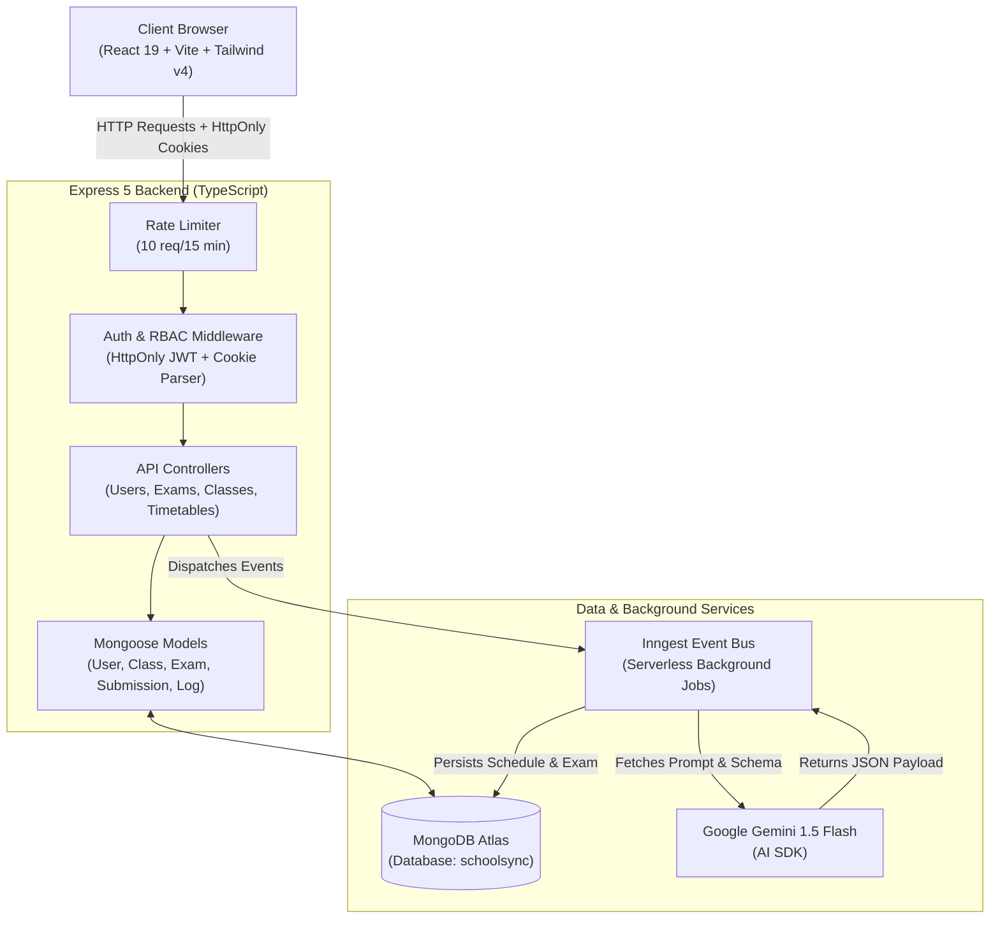

# 🎓 SchoolSync — Enterprise Multi-Role School Management & Academic Operations Platform

<div align="center">

[](https://www.typescriptlang.org/)
[](https://react.dev/)
[](https://nodejs.org/)
[](https://expressjs.com/)
[](https://www.mongodb.com/)
[](https://tailwindcss.com/)
[](https://www.inngest.com/)
[](https://opensource.org/licenses/MIT)

<p align="center">
  <b>An enterprise-ready, role-based educational management system engineered with a 3-tier Service Architecture, strict request validation, and automated academic scheduling workflows.</b>
</p>

</div>

---

## 📑 Table of Contents

- [Overview](#-overview)
- [Key Features & Modules](#-key-features--modules)
- [System Architecture (3-Tier Service Pattern)](#-system-architecture)
- [Role-Based Access Control (RBAC) Matrix](#-role-based-access-control-rbac-matrix)
- [REST API Specification](#-rest-api-specification)
- [Tech Stack & Tooling](#-tech-stack--tooling)
- [Repository Structure](#-repository-structure)
- [Environment Configuration](#-environment-configuration)
- [Quick Start Guide](#-quick-start-guide)
- [Automated Testing & Security Verification](#-automated-testing--security-verification)
- [Security & Engineering Hardening](#-security--engineering-hardening)
- [Contributing & License](#-contributing--license)

---

## 📌 Overview

**SchoolSync** is a production-hardened school management platform engineered to eliminate operational bottlenecks, scheduling collisions, and data isolation vulnerabilities across educational institutions.

### Core Architectural Pillars:
1. **3-Tier Service Architecture (`Routes → Validators → Controllers → Services → Models`):** Pure separation of transport concerns, business logic, and database mutations.
2. **Zero-Trust Resource Authorization:** Multi-role RBAC combined with resource ownership isolation (preventing cross-teacher assessment tampering, student cross-class schedule leakage, and unauthorized privilege escalation).
3. **Automated Conflict-Free Scheduling:** Background worker pipeline ensuring teacher-subject qualification mapping, break slot allocations, and zero double-booking.
4. **Hardened Request Validation:** Declarative schemas rejecting malformed inputs with detailed HTTP 400 responses prior to controller execution.

---

## ✨ Key Features & Modules

### 1. 📊 Adaptive Role-Based Dashboard
- **Admin View:** Live metrics for total enrolled students, active faculty, ongoing examinations, and system-wide audit activity logs.
- **Teacher View:** Assigned classroom count, pending submission grading queues, lecture schedule, and quick-action assessment builder.
- **Student View:** Enrolled class timetable, pending quizzes, exam countdowns, and performance scorecards.
- **AI Academic Advisor Widget:** On-demand heuristic analysis providing contextual academic observations.

### 2. ⚡ Conflict-Free Weekly Timetable Generator
- Automated weekly schedule compilation (Monday–Friday).
- Enforces strict constraints:
  - Teachers are only assigned to periods matching their qualified subject codes.
  - No teacher or classroom can be double-booked.
  - Respects customized period durations, start/end times, and lunch breaks.
- Background generation managed via **Inngest** to eliminate HTTP request timeouts.

### 3. 📝 Learning Management & Assessment Engine (LMS)
- **Prompt-to-Exam Generation:** Teachers provide topic, difficulty, and question count; Gemini AI produces structured questions with validated schemas.
- **Answer Key Protection:** Answer keys are stripped in default student queries and only exposed to authoring teachers or admins.
- **Student Testing Portal:** Live examination interface with real-time timers and submission locking.
- **Asynchronous Auto-Grading:** Student answers are scored automatically against correct keys and scores are immediately computed.

### 4. 👥 Universal Directory & User Management
- Filtered directory views for Admins, Teachers, Students, and Parents.
- Server-side pagination, search with ReDoS regex escaping, and sorting.
- Teacher access restricted: faculty can only manage student accounts in their scope and cannot elevate privileges.

### 5. 🏫 Academic Year & Curriculum Structure
- Atomic active academic year switching (ensures only one active year across the entire school).
- Class capacity monitoring and multi-subject curriculum mapping.
- Unique compound indexing (`name + academicYear`) preventing duplicate class registration.

---

## 🏗️ System Architecture



---

## 👥 Role-Based Access Control (RBAC) Matrix

| Module / Operation | Admin | Teacher | Student | Parent |
| :--- | :---: | :---: | :---: | :---: |
| **Manage Academic Years & Global Settings** | ✅ Full | ❌ | ❌ | ❌ |
| **Create/Edit Admin & Teacher Accounts** | ✅ Full | ❌ | ❌ | ❌ |
| **Create/Edit Student Accounts** | ✅ Full | ✅ Allowed | ❌ | ❌ |
| **Manage Classes & Subject Curriculums** | ✅ Full | 👁️ Read-Only | ❌ | ❌ |
| **Trigger AI Timetable Generation** | ✅ Full | ❌ | ❌ | ❌ |
| **View Class Schedules** | ✅ All | ✅ All | 🔒 Enrolled Class | 🔒 Child Class |
| **Generate & Publish AI Assessments** | ✅ All | 🔒 Authored Exams | ❌ | ❌ |
| **Take Assessments & Submit Answers** | ❌ | ❌ | ✅ Enrolled Class | ❌ |
| **View Scores & Performance Reviews** | ✅ All | 🔒 Authored Exams | 🔒 Personal | 🔒 Child |
| **System Security & Activity Audit Trail** | ✅ Full | ❌ | ❌ | ❌ |

---

## 📡 REST API Specification

### Authentication & Users (`/api/users`)
| Method | Endpoint | Access | Description |
| :--- | :--- | :--- | :--- |
| `POST` | `/api/users/login` | Public | Authenticates credentials and issues secure HttpOnly JWT cookie |
| `POST` | `/api/users/register` | Admin / Teacher | Registers new user (Teachers restricted to `student` role) |
| `POST` | `/api/users/logout` | Public | Clears authentication cookie |
| `GET` | `/api/users/profile` | Authenticated | Retrieves current authenticated session details |
| `GET` | `/api/users` | Admin / Teacher | Paginated & searchable user directory |
| `PUT` | `/api/users/update/:id` | Admin / Teacher | Updates user attributes (Teacher restricted to student scope) |
| `DELETE` | `/api/users/delete/:id` | Admin / Teacher | Removes user (Protected against self-deletion) |

### Academics & Classes (`/api/classes`, `/api/subjects`, `/api/academic-years`)
| Method | Endpoint | Access | Description |
| :--- | :--- | :--- | :--- |
| `GET` | `/api/academic-years` | Admin / Teacher | Retrieves all academic years with current active status |
| `POST` | `/api/academic-years/create`| Admin | Creates new academic year with atomic current-flag handling |
| `GET` | `/api/classes` | Admin / Teacher | Paginated list of classes with enrolled students & subjects |
| `POST` | `/api/classes/create` | Admin | Creates class with capacity and teacher assignment |
| `PUT` | `/api/classes/update/:id` | Admin | Modifies class configuration and curriculum |
| `GET` | `/api/subjects` | Admin / Teacher | Paginated list of academic subjects |
| `POST` | `/api/subjects/create` | Admin | Registers new subject with unique code verification |

### Timetables & AI Scheduling (`/api/timetables`)
| Method | Endpoint | Access | Description |
| :--- | :--- | :--- | :--- |
| `POST` | `/api/timetables/generate` | Admin | Dispatches background AI generation event to Inngest |
| `GET` | `/api/timetables/:classId` | Authenticated | Retrieves weekly schedule (Students restricted to enrolled class) |

### LMS & Assessments (`/api/exams`)
| Method | Endpoint | Access | Description |
| :--- | :--- | :--- | :--- |
| `POST` | `/api/exams/generate` | Admin / Teacher | Dispatches AI quiz generation with topic and difficulty |
| `GET` | `/api/exams` | Authenticated | Lists exams (Role-filtered: Student enrolled, Teacher authored) |
| `GET` | `/api/exams/:id` | Authenticated | Exam details (Exposes answer keys to faculty/admin only) |
| `PATCH`| `/api/exams/:id/status` | Admin / Teacher | Toggles Draft / Published state (Validates deadline & question count) |
| `POST` | `/api/exams/:id/submit` | Student | Validates deadline & class enrollment before grading queue |
| `GET` | `/api/exams/:id/result` | Authenticated | Retrieves student score and submitted response review |
| `DELETE`| `/api/exams/:id` | Admin / Teacher | Cascades deletion of exam and all student submissions |

---

## 🛠️ Tech Stack & Tooling

| Layer | Technologies |
| :--- | :--- |
| **Frontend Framework** | React 19, Vite (Rolldown), TypeScript 5.9 |
| **Styling & Components** | Tailwind CSS v4, Radix UI Primitives, Lucide Icons, Sonner |
| **State & Routing** | React Router v7, React Hook Form, Zod Validation |
| **Backend Runtime** | Node.js / Bun, Express.js 5, TypeScript |
| **Database & ODM** | MongoDB Atlas, Mongoose 9 |
| **AI & Background Workers**| Google Gemini 1.5 Flash (`@ai-sdk/google`), Inngest 3.48 |
| **Security & Utilities** | Helmet, Cookie-Parser, BcryptJS, JSONWebToken, Express Rate Limiter |

---

## 📁 Repository Structure

```text
School-Management/
├── backend/
│   ├── src/
│   │   ├── config/              # MongoDB connection & system bootstrap
│   │   ├── controllers/         # HTTP Transport layer (User, Exam, Class, Timetable...)
│   │   ├── services/            # Business Logic layer (UserService, ExamService, ClassService...)
│   │   ├── validators/          # Typed input validation schemas & sanitizers
│   │   ├── inngest/             # Asynchronous workers & background event handlers
│   │   ├── middleware/          # JWT Protect, Role Authorizer, ValidateBody, Rate Limiter
│   │   ├── models/              # Mongoose schemas & compound indexes (User, Class, Exam...)
│   │   ├── routes/              # Express API route declarations
│   │   ├── tests/               # Automated test suites (Auth, RBAC, Validation, Security)
│   │   │   ├── auth_token.test.ts
│   │   │   ├── resource_authorization.test.ts
│   │   │   ├── request_validation.test.ts
│   │   │   └── security_rbac.test.ts
│   │   ├── utils/               # Sanitizers, token generators, logging helpers
│   │   └── server.ts            # Application entrypoint & fail-closed boot checks
│   ├── tsconfig.json
│   ├── package.json
│   └── .env.example
├── frontend/
│   ├── src/
│   │   ├── components/          # Reusable UI widgets, forms, dialogs, sidebars
│   │   ├── hooks/               # Authentication & theme context providers
│   │   ├── lib/                 # Axios client instance with cookie credentials
│   │   ├── pages/               # Application routes (Dashboard, LMS, Timetable, Users)
│   │   ├── types.ts             # Global TypeScript interface definitions
│   │   ├── index.css            # Tailwind CSS design system configuration
│   │   └── main.tsx             # React application DOM entrypoint
│   ├── tsconfig.app.json
│   ├── package.json
│   └── .env.example
└── README.md
```

---

## ⚙️ Environment Configuration

### Backend Configuration (`backend/.env`)

Create a `.env` file in the `backend/` directory:

```env
# Server Port & Mode
PORT=5000
NODE_ENV=development
STAGE=development

# Database Connection (MongoDB Atlas)
MONGO_URL=mongodb+srv://<username>:<password>@cluster0.b872qiu.mongodb.net/schoolsync?retryWrites=true&w=majority

# JWT Security
JWT_SECRET=your_super_secret_jwt_key_at_least_32_characters_long

# AI Integrations
GOOGLE_GENERATIVE_AI_API_KEY=AIzaSy...your_gemini_api_key

# CORS Frontend Origin
CLIENT_URL=http://localhost:5173
```

### Frontend Configuration (`frontend/.env`)

Create a `.env` file in the `frontend/` directory:

```env
# Base API URL
VITE_API_BASE_URL=http://localhost:5000/api
```

---

## 🚀 Quick Start Guide

### 1. Clone Repository
```bash
git clone https://github.com/Sekhar01807/School-Management.git
cd School-Management
```

### 2. Setup & Start Backend
```bash
cd backend
npm install
cp .env.example .env
# Edit .env with your MongoDB URL, JWT_SECRET, and Gemini API Key

npm run dev
```

### 3. Setup & Start Frontend
```bash
# Open a new terminal
cd frontend
npm install
cp .env.example .env

npm run dev
```

### 4. Open in Browser
Visit **`http://localhost:5173`** to access the SchoolSync portal.

---

## 🧪 Automated Testing & Security Verification

SchoolSync includes a 4-suite automated test matrix verifying all critical system guarantees:
1. **`auth_token.test.ts`**: JWT signing/verification, expired token rejection, tampered signature defense, HttpOnly cookie security, and inactive user rejection.
2. **`resource_authorization.test.ts`**: Teacher assessment IDOR isolation (Teacher A vs. Teacher B), student class boundary locks, and privilege escalation defense.
3. **`request_validation.test.ts`**: Input boundary validation (missing fields, malformed email/passwords, invalid dates, invalid question counts).
4. **`security_rbac.test.ts`**: In-memory login rate limiter (10 attempts / 15 mins), ReDoS query regex escaping, and exam publishing validation.

Run the test suite:
```bash
cd backend
npm test
```

---

## 🔒 Security & Engineering Hardening

1. **HttpOnly Cookie Tokens:** Sessions are delivered inside secure `HttpOnly`, `SameSite=Strict` cookies to block XSS token theft.
2. **Defensive Data Transfer (DTO):** Password hashes and sensitive fields are explicitly excluded in queries and JSON responses.
3. **Fail-Closed Boot Architecture:** The backend refuses to boot if mandatory secrets (`JWT_SECRET`, `MONGO_URL`) are missing or unconfigured.
4. **ReDoS Query Sanitization:** Search queries are processed through regex character escapers prior to Mongo `$regex` execution.
5. **Rate-Limiting Protection:** Built-in rate limiting (10 attempts / 15 minutes) prevents brute-force credential stuffing on the login route.

---

## 📄 License

This project is licensed under the **MIT License** — see the [LICENSE](LICENSE) file for details.
