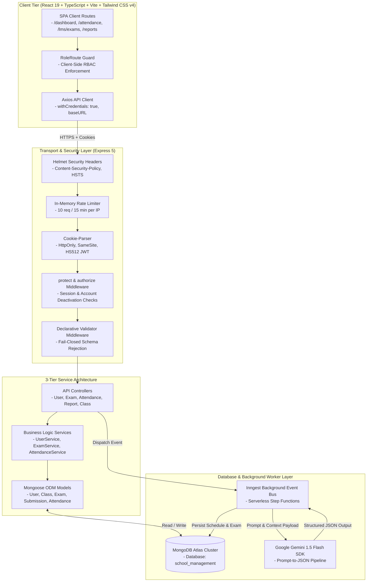
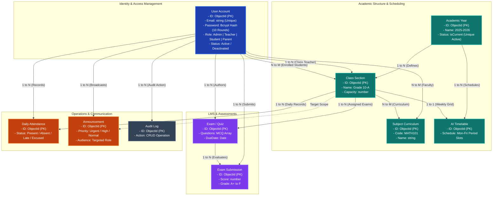

# SchoolSync — Enterprise Academic Operations & Management Platform

<div align="center">


<br/>

[](https://www.typescriptlang.org/)
[](https://react.dev/)
[](https://nodejs.org/)
[](https://expressjs.com/)
[](https://www.mongodb.com/)
[](https://tailwindcss.com/)
[](https://ai.google.dev/)
[](https://www.inngest.com/)
[](https://opensource.org/licenses/MIT)

<br/>

**SchoolSync** is an enterprise-grade, multi-role academic management and institution operations platform. Engineered with a strict 3-tier Service Architecture, automated AI scheduling engines, dynamic assessment portals, real-time attendance analytics, and multi-tenant resource isolation (IDOR protection).

[Overview](#executive-summary) • [Architecture](#system-architecture) • [RBAC Matrix](#role-based-access-control-rbac) • [REST API Reference](#rest-api-specification) • [Deployment](#production-deployment-guide) • [Tests](#automated-testing--security-verification)

</div>

---

## Table of Contents

1. [Executive Summary](#executive-summary)
2. [Core Subsystems & Technical Capabilities](#core-subsystems--technical-capabilities)
3. [Verified Seed Credentials](#verified-seed-credentials)
4. [System Architecture & Data Flow](#system-architecture)
5. [Database Relational Architecture](#database-relational-architecture)
6. [Role-Based Access Control (RBAC)](#role-based-access-control-rbac)
7. [REST API Specification](#rest-api-specification)
8. [Security Engineering & IDOR Hardening](#security-engineering--idor-hardening)
9. [Technology Stack](#technology-stack)
10. [Repository Structure](#repository-structure)
11. [Environment Variables](#environment-variables)
12. [Local Development Quickstart](#local-development-quickstart)
13. [Automated Testing & Security Verification](#automated-testing--security-verification)
14. [Production Deployment Guide](#production-deployment-guide)
15. [License & Maintainers](#license--maintainers)

---

## Executive Summary

Modern educational institutions often grapple with fragmented software stacks: manual timetable collisions, disparate quiz tools, unverified attendance records, and security vulnerabilities like broken object-level authorization (IDOR). 

**SchoolSync** solves these challenges through a unified, 100% dynamic platform built on modern web standards:
- **Zero-Trust Access Control:** Cryptographically signed HS512 JWTs stored in `HttpOnly`, `SameSite=none`, `secure=true` cookies.
- **Fail-Closed Validation Pipeline:** Rejects malformed HTTP payloads via declarative schemas before controller execution.
- **Event-Driven AI Scheduling:** Offloads complex weekly timetable optimization and question generation to asynchronous Inngest worker pipelines powered by Google Gemini 1.5 Flash.
- **Dynamic Real-Time Data Flow:** Instant reactivity across all client views connected to a dedicated MongoDB Atlas cluster.

---

## Core Subsystems & Technical Capabilities

### 1. Role-Adaptive Dynamic Dashboard
- **Admin Context:** Campus metrics including total active student body, faculty directory count, ongoing exams, campus-wide daily attendance rate, and real-time audit logs.
- **Teacher Context:** Assigned classroom count, lecture agenda, active quiz tracking, and quick exam generation actions.
- **Student Context:** Class weekly timetable, active and upcoming exam countdowns, attendance percentage indicator, and GPA report cards.
- **AI Academic Advisor:** Contextual observations and performance analysis delivered dynamically via LLM heuristics.

### 2. Conflict-Free AI Timetable Generator
- **Engine:** Inngest serverless step functions paired with Google Gemini 1.5 Flash structured output schemas.
- **Constraint Solver Enforces:**
  - Zero double-booking across faculty schedules during identical time periods.
  - Zero classroom space collisions across overlapping academic sections.
  - Teacher-subject qualification alignment (`MATH101`, `PHY101`, `ENG101`).
  - Configurable periods per day, custom period durations (30–60 mins), and automated lunch breaks.

### 3. Online Assessment & LMS Exam Engine
- **AI Question Synthesis:** Faculty input topic, subject, difficulty, and question count; Gemini AI produces structured multi-choice questions with validated option sets.
- **Automated Deadline & Status Guardrails:** Draft exams cannot be published without questions or with expired due dates.
- **Answer Key Defense:** Correct answers are sanitized and stripped from all student-facing endpoints; exposed strictly to the authoring faculty member or administrators.
- **Asynchronous Auto-Grading:** Student answers are evaluated against server-side keys, percentage scores calculated, and GPA grade letters assigned (`A+` through `F`).

### 4. Campus Daily Attendance Operations
- **Daily Register:** Teachers and administrators record attendance per class with distinct status flags: `Present`, `Absent`, `Late`, `Excused`.
- **Institutional Analytics:** Real-time campus-wide attendance percentage, class-level distribution, and historical logs.
- **Student Self-Service Portal:** Students view personal attendance health indicators with threshold warnings.

### 5. Institutional Announcements & Broadcasts
- **Targeted Audience Routing:** Broadcast notices institution-wide (`All`), to faculty (`Teachers`), to learners (`Students`), or to specific grade sections.
- **Priority Categorization:** Flagged with urgency tiers: `Urgent`, `High`, `Medium`, and `Low`.
- **Author Scoping:** Authors and administrators maintain full edit/delete privileges with instantaneous broadcast updates.

### 6. Academic Performance & GPA Analytics
- **Student Report Cards:** Real-time cumulative GPA computation (0.00 – 4.00), letter grade mapping, subject breakdowns, and instructor feedback.
- **Class Analytics:** Class-level average GPA, top performers, subject pass rates, and visual performance charts rendered via Recharts.
- **Campus Metrics:** School-wide grade distributions, exam completion rates, and historical academic trends.

### 7. Universal Directory & User Management
- **Directory Management:** Role-segregated views for Students, Teachers, Parents, and Administrators.
- **ReDoS-Safe Search & Pagination:** All search queries are filtered through regex metacharacter escapers prior to database execution.
- **Privilege Boundary Enforcement:** Faculty can create and update student accounts, but are strictly barred from modifying other faculty or elevating roles.

### 8. Client-Side Route Guards & Smart 404/403 Handling
- **`<RoleRoute />` Component:** Protects application routes on the client side, intercepting unauthorized access attempts.
- **Intelligent Error Dispatcher:**
  - **Authenticated Users:** Displays customized 403/404 views, active user context pill, and a direct **"Go to Dashboard"** primary button.
  - **Unauthenticated Guests:** Displays descriptive error tags and a direct **"Go to Home Page"** / **"Sign In"** button.

### 9. Self-Service Profile Management & Enterprise Password Security
- **Unified Profile Portal (`/settings/profile`):** Edit profile details, select avatar presets or custom URLs, update phone numbers and addresses, and maintain emergency contact details for students/parents.
- **Interactive User Navigation:** Sidebar user pill upgraded to an interactive dropdown with quick access to Profile & Settings, Change Password, and Sign Out.
- **Enterprise Password Policy:** Enforces 8+ characters, uppercase, lowercase, numbers, special symbols, dictionary blacklist defense, and email prefix rejection.
- **Live Password Strength Meter:** Interactive visual checklist on registration, settings, and password recovery screens.
- **Secure Password Reset Flow:** Dispatches cryptographic SHA-256 tokens valid for 15 minutes, with a dedicated `/reset-password` page.

### 10. Transactional Email Notification Subsystem
- **Multi-Provider Email Engine:** Seamless delivery via Gmail SMTP (Google App Password), custom SMTP servers (SendGrid, Mailgun, Amazon SES, Mailtrap), or Resend API, with automatic console fallback for local development.
- **One-Time Welcome Onboarding Card:** Automatically delivered to newly registered users with role summaries, permissions checklist, and direct dashboard access links.
- **Instant Attendance Alerts:** Automatically notifies students and linked parent inboxes whenever marked Absent.
- **Exam Published Alerts:** Automatically notifies all students enrolled in a class when an examination is published.
- **Urgent Campus Broadcasts:** Delivers urgent notices directly to targeted recipient mailboxes.

### 11. Database Compound Indexing & Query Optimization
- **Mongoose Indexing:** High-cardinality queries are fully optimized using compound indexes:
  - `User`: `{ role: 1, isActive: 1 }`, `{ studentClass: 1 }`, `{ parentId: 1 }`, `{ resetPasswordToken: 1 }`
  - `Attendance`: `{ class: 1, date: 1 }`, `{ "records.student": 1, date: -1 }`
  - `Submission`: `{ exam: 1, student: 1 }` (unique), `{ student: 1, submittedAt: -1 }`
  - `Exam`: `{ class: 1, isActive: 1, dueDate: 1 }`, `{ teacher: 1, createdAt: -1 }`, `{ subject: 1 }`
  - `Announcement`: `{ audience: 1, isActive: 1, createdAt: -1 }`, `{ targetClass: 1, isActive: 1 }`, `{ priority: 1, createdAt: -1 }`

---

## Verified Seed Credentials

The database includes pre-configured demo credentials initialized on boot (in development) or explicitly via `npm run db:seed`:

| Account Role | Email | Password | Pre-Assigned Context |
| :--- | :--- | :--- | :--- |
| **System Administrator** | `admin@schoolsync.com` | `password123` | Full institutional access across all modules |
| **Faculty Member** | `teacher@schoolsync.com` | `password123` | Assigned to Grade 10-A (Mathematics, Physics, English) |
| **Enrolled Student** | `student@schoolsync.com` | `password123` | Enrolled in **Grade 10-A** (Linked to Robert Johnson) |
| **Parent / Guardian** | `parent@schoolsync.com` | `password123` | Linked to **Alex Johnson** (Grade 10-A) |

> [!NOTE]
> Seed credentials and startup auto-seeding are fully configurable via environment variables (`DEFAULT_ADMIN_EMAIL`, `DEFAULT_ADMIN_PASSWORD`, `SEED_DEFAULT_DATA=true`). In production environments, database seeding strictly requires custom credentials (`DEFAULT_ADMIN_PASSWORD`) and will reject insecure defaults (`password123`).

---

## System Architecture



---

## Database Relational Architecture



---

## Role-Based Access Control (RBAC)

| Functional Domain | Resource / Operation | Administrator | Faculty (Teacher) | Learner (Student) | Guardian (Parent) |
| :--- | :--- | :---: | :---: | :---: | :---: |
| **System Settings** | Academic Years CRUD | Full Access | View Active | View Active | View Active |
| **Self-Service** | Personal Profile Update | Self Profile | Self Profile | Self Profile | Self Profile |
| | Password Change & Reset | Self Account | Self Account | Self Account | Self Account |
| **Security & Logs** | System Activity Audit Log | Full Access | No Access | No Access | No Access |
| **User Directory** | Manage Faculty & Parents | Full Access | No Access | No Access | No Access |
| | Manage Students | Full Access | Manage Assigned | No Access | No Access |
| **Academic Setup** | Classes & Subject Curriculums | Full Access | View / Assign | View Enrolled | View Enrolled |
| **AI Scheduling** | Generate Weekly Timetables | Full Access | View Schedules | View Enrolled Class | View Child Class |
| **LMS & Exams** | Generate & Author Quizzes | Full Access | Manage Authored | No Access | No Access |
| | Take Quizzes & Submit Answers | Restricted (Staff) | Restricted (Staff) | Enrolled Class Only | No Access |
| **Attendance** | Mark Daily Attendance Register | Full Access | Assigned Classes | No Access | No Access |
| | View Attendance Analytics | Campus Overview | Class Statistics | Personal Record | Child Record |
| **Communication** | Broadcast Announcements | Full Access | Manage Authored | View Targeted | View Targeted |
| **Performance** | Academic Reports & GPA Cards | School-wide | Class Analytics | Personal Report | Child Report |

---

## REST API Specification

### 1. Authentication & Users (`/api/users`)
| Method | Endpoint | Authorization | Description |
| :--- | :--- | :--- | :--- |
| `POST` | `/api/users/login` | Public (Rate Limited) | Authenticates credentials and issues secure HS512 JWT cookie |
| `POST` | `/api/users/register` | Public / Admin / Teacher | Registers new user (Public/Teachers strictly restricted to `student` role) |
| `POST` | `/api/users/logout` | Public | Clears and expires authentication cookie |
| `GET` | `/api/users/profile` | Authenticated | Retrieves current authenticated session object |
| `PUT` | `/api/users/profile` | Authenticated | Self-service profile updates (Name, phone, address, emergency contact, avatar) |
| `PUT` | `/api/users/change-password` | Authenticated | Self-service password change with current password verification |
| `POST` | `/api/users/forgot-password` | Public | Dispatches cryptographic 15-minute password reset link to registered email |
| `POST` | `/api/users/reset-password` | Public | Validates SHA-256 token and resets account password |
| `GET` | `/api/users` | Admin / Teacher | Searchable & paginated user directory |
| `PUT` | `/api/users/update/:id` | Admin / Teacher | Updates user attributes (IDOR & role escalation protected) |
| `DELETE` | `/api/users/delete/:id` | Admin / Teacher | Removes user (Protected against self-deletion) |

### 2. Academics (`/api/classes`, `/api/subjects`, `/api/academic-years`)
| Method | Endpoint | Authorization | Description |
| :--- | :--- | :--- | :--- |
| `GET` | `/api/academic-years` | Admin / Teacher | Retrieves all academic years with current active flag |
| `POST` | `/api/academic-years/create`| Admin | Creates new academic year with single-active constraint |
| `GET` | `/api/classes` | Admin / Teacher | Paginated list of classes with enrolled students & subjects |
| `POST` | `/api/classes/create` | Admin | Registers new class section with capacity and teacher assignment |
| `PUT` | `/api/classes/update/:id` | Admin | Modifies class configuration and curriculum |
| `GET` | `/api/subjects` | Admin / Teacher | Paginated list of academic subjects |
| `POST` | `/api/subjects/create` | Admin | Registers new subject with unique code verification |

### 3. AI Timetable Scheduling (`/api/timetables`)
| Method | Endpoint | Authorization | Description |
| :--- | :--- | :--- | :--- |
| `POST` | `/api/timetables/generate` | Admin | Dispatches background AI generation event to Inngest pipeline |
| `GET` | `/api/timetables/:classId` | Authenticated | Retrieves weekly schedule (Students restricted to enrolled class) |

### 4. LMS & Assessments (`/api/exams`)
| Method | Endpoint | Authorization | Description |
| :--- | :--- | :--- | :--- |
| `POST` | `/api/exams/generate` | Admin / Teacher | Dispatches AI quiz generation with topic and difficulty |
| `GET` | `/api/exams` | Authenticated | Lists exams (Role filtered: student enrolled, teacher authored) |
| `GET` | `/api/exams/:id` | Authenticated | Exam details (Answer keys stripped for students) |
| `PATCH`| `/api/exams/:id/status` | Admin / Teacher | Toggles draft/published state (Validates deadline & question count) |
| `POST` | `/api/exams/:id/submit` | Student | Submits exam answers for automated grading queue |
| `GET` | `/api/exams/:id/result` | Authenticated | Returns score breakdown, percentage, and grade letter (IDOR guarded) |
| `DELETE`| `/api/exams/:id` | Admin / Teacher | Cascades deletion of exam and associated student submissions |

### 5. Attendance Operations (`/api/attendance`)
| Method | Endpoint | Authorization | Description |
| :--- | :--- | :--- | :--- |
| `POST` | `/api/attendance` | Admin / Teacher | Records class attendance (Restricted to assigned teachers) |
| `GET` | `/api/attendance/overview` | Admin / Teacher | Campus-wide attendance summary & rates |
| `GET` | `/api/attendance/student/me`| Student / Parent | Retrieves student personal attendance record |
| `GET` | `/api/attendance/student/:studentId`| Admin / Teacher / Parent | IDOR-protected attendance summary for a student |
| `GET` | `/api/attendance/class/:classId`| Admin / Teacher | Class attendance by date or range (Restricted to assigned classes) |

### 6. Announcements (`/api/announcements`)
| Method | Endpoint | Authorization | Description |
| :--- | :--- | :--- | :--- |
| `GET` | `/api/announcements` | Authenticated | Retrieves announcements targeted to the caller's role |
| `POST` | `/api/announcements` | Admin / Teacher | Publishes announcement with audience and priority tags |
| `PUT` | `/api/announcements/:id` | Admin / Author | Updates announcement content or pinned status |
| `DELETE`| `/api/announcements/:id` | Admin / Author | Deletes announcement |

### 7. Performance & GPA Reports (`/api/reports`)
| Method | Endpoint | Authorization | Description |
| :--- | :--- | :--- | :--- |
| `GET` | `/api/reports/student/me` | Student / Parent | Generates student report card with calculated GPA |
| `GET` | `/api/reports/student/:studentId` | Admin / Teacher / Parent | IDOR-protected student report card |
| `GET` | `/api/reports/class/:classId` | Admin / Teacher | Computes class GPA averages and subject pass rates (Assigned only) |
| `GET` | `/api/reports/school` | Admin / Teacher | Campus-wide metrics and institutional scorecard |

### 8. Institutional Exports (`/api/export`)
| Method | Endpoint | Authorization | Description |
| :--- | :--- | :--- | :--- |
| `GET` | `/api/export/attendance/:classId` | Admin / Teacher | Streams monthly class attendance matrix in Excel-compatible CSV |
| `GET` | `/api/export/report-card/:studentId` | Admin / Teacher / Student / Parent | Streams student GPA transcript & assessment report card in CSV |
| `GET` | `/api/export/students` | Admin / Teacher | Streams searchable student directory roster with emergency contacts in CSV |

### 9. Media & File Uploads (`/api/upload`)
| Method | Endpoint | Authorization | Description |
| :--- | :--- | :--- | :--- |
| `POST` | `/api/upload/avatar` | Authenticated | Uploads user profile image (Max 2MB, JPEG/PNG/WebP) and updates avatar URL |

---

## Security Engineering & IDOR Hardening

1. **Public Registration Role Escalation Defense:**
   - Public unauthenticated registration (`POST /api/users/register`) strictly forces `role = "student"`. Requests requesting `admin`, `teacher`, or `parent` roles without admin authentication are rejected with `403 Forbidden`.
2. **Attendance Authorization Enforcement:**
   - Class attendance recording (`POST /api/attendance`) and inspection (`GET /api/attendance/class/:classId`) require teachers to be assigned as either the class teacher or subject teacher for the target section.
3. **Student Record IDOR Protection:**
   - Access to `/api/attendance/student/:studentId` and `/api/reports/student/:studentId` enforces centralized tenant boundaries (`canAccessStudentData`). Parents can only view their registered children; teachers can only view students in classes they teach; students can only view themselves.
4. **Environment-Controlled Seeding & Production Credential Hardening:**
   - Automatic database seeding is disabled by default in `production` environments.
   - When explicitly invoked in production, the seed pipeline validates that `DEFAULT_ADMIN_PASSWORD` is supplied, non-empty, and distinct from the demo default (`password123`), halting execution if insecure defaults are detected.
5. **NoSQL Query & Parameter Sanitization:**
   - Global recursive sanitization middleware ([`sanitize.ts`](backend/src/middleware/sanitize.ts)) strips MongoDB injection keys (`$where`, `$gt`, `$ne`, and dot-notation paths) from all incoming request bodies, query strings, and route parameters.
6. **Multi-Tier Rate Limiting Defense:**
   - Dedicated in-memory rate limiters protect authentication (`/login`), password recovery (`/forgot-password`), new account registration (`/register`), and report export streams (`/export/*`).
7. **HttpOnly Cross-Origin Cookie Security:**
   - Tokens are cryptographically signed using **HS512** with a 30-day lifecycle.
   - Delivered via `HttpOnly`, `SameSite=none`, `secure=true` cookies in production, eliminating browser-based XSS token theft.
8. **Graceful Process Termination:**
   - `SIGTERM` and `SIGINT` process listeners ensure clean HTTP server termination and safe MongoDB disconnection during deployments.
9. **Fail-Closed Startup Boot System:**
   - The backend actively verifies mandatory environment variables (`JWT_SECRET`, `MONGO_URL`) on boot and safely halts if secrets are missing.
10. **No-Cache & Disabled ETags:**
    - Configured `app.set("etag", false)` and `Cache-Control: no-store, no-cache` headers to prevent stale 304 browser caching on dynamic mutations.

---

## Technology Stack

```
FRONTEND LAYER                          BACKEND LAYER                           DATABASE & AI
├── React 19.2.0                        ├── Express.js 5.2.1                   ├── MongoDB Atlas (v7.5)
├── TypeScript 5.9.3                    ├── TypeScript 5.9                     ├── Mongoose ODM 9.1.1
├── Vite 7.2.5 (Rolldown)               ├── JSONWebToken (HS512)               ├── Google Gemini 1.5 Flash
├── Tailwind CSS v4.1.18                ├── BcryptJS 3.0.3                     ├── Inngest Event Bus (3.48)
├── Radix UI Primitives                 ├── Helmet 8.1.0                       └── Node.js Native Test Runner
├── Lucide React 0.562.0                ├── Cookie-Parser 1.4.7
├── React Router v7.11.0                └── Morgan HTTP Logger
└── Recharts 2.15.4
```

---

## Repository Structure

```text
School-Management/
├── backend/
│   ├── src/
│   │   ├── config/              # MongoDB connection & system bootstrap
│   │   │   ├── db.ts
│   │   │   └── seedDefaultData.ts
│   │   ├── controllers/         # HTTP Transport controllers (User, Exam, Attendance...)
│   │   ├── services/            # Business Logic layer (UserService, ExamService...)
│   │   ├── validators/          # Declarative request validation schemas
│   │   ├── inngest/             # AI event workflows (Timetable & Quiz generators)
│   │   ├── middleware/          # JWT Protect, Role Authorizer, Rate Limiter, Validate
│   │   ├── models/              # Mongoose schemas (User, Class, Exam, Attendance...)
│   │   ├── routes/              # Express API route declarations
│   │   ├── tests/               # Automated Node.js native test suites (node:test)
│   │   │   ├── auth_token.test.ts
│   │   │   ├── resource_authorization.test.ts
│   │   │   ├── request_validation.test.ts
│   │   │   ├── security_rbac.test.ts
│   │   │   └── business_logic.test.ts
│   │   ├── scripts/             # Unified database wipe and fresh seed manager
│   │   │   └── cleanDb.ts
│   │   ├── utils/               # Regex escapers, token generators, logging helpers
│   │   └── server.ts            # Entrypoint & fail-closed boot checks
│   ├── tsconfig.json
│   ├── package.json
│   └── .env.example
├── frontend/
│   ├── src/
│   │   ├── components/          # Reusable UI widgets, forms, dialogs, sidebars
│   │   ├── hooks/               # Authentication & theme context providers
│   │   ├── lib/                 # Axios client instance with cookie credentials
│   │   ├── pages/               # Application routes
│   │   │   ├── Dashboard.tsx
│   │   │   ├── NotFound.tsx     # 404 / 403 Smart Error Page
│   │   │   ├── academics/       # Classes, Subjects, Timetable, Attendance, Reports
│   │   │   ├── communication/   # Announcements
│   │   │   ├── lms/             # Quiz taking & Exam Generator
│   │   │   ├── users/           # Students, Teachers, Parents, Admins
│   │   │   └── routes/          # RoleRoute guards & browser router
│   │   ├── types.ts             # Global TypeScript interface definitions
│   │   ├── index.css            # Tailwind CSS design system configuration
│   │   └── main.tsx             # React application DOM entrypoint
│   ├── vercel.json              # SPA rewrite rules for Vercel
│   ├── public/
│   │   └── _redirects           # SPA rewrite rules for Netlify/Render
│   ├── tsconfig.app.json
│   ├── package.json
│   └── .env.example
├── .gitignore                   # Comprehensive root gitignore
└── README.md                    # Project master documentation
```

---

## Environment Variables

### Backend Configuration (`backend/.env`)

```env
# Server & Port
PORT=5000
NODE_ENV=development
STAGE=development

# Database Connection (MongoDB Atlas)
MONGO_URL=mongodb+srv://<username>:<password>@cluster0.b872qiu.mongodb.net/school_management?retryWrites=true&w=majority
RESET_DB=false

# Authentication & Security
JWT_SECRET=your_super_secret_jwt_key_at_least_32_characters_long
COOKIE_SAME_SITE=lax

# AI Integrations (Google Gemini)
GOOGLE_GENERATIVE_AI_API_KEY=your_gemini_api_key

# CORS Frontend Origin
CLIENT_URL=http://localhost:5173

# Transactional Email Notification Service
# (Supports SMTP host, Gmail App Password, or Resend API)
EMAIL_FROM="SchoolSync Notifications" <notifications@schoolsync.com>
SMTP_HOST=smtp.mailtrap.io
SMTP_PORT=587
SMTP_USER=your_smtp_username
SMTP_PASS=your_smtp_password
# SMTP_SERVICE=gmail # Or shorthand for Gmail/Outlook
# RESEND_API_KEY=re_123456789 # Or Resend API Key
```

### Frontend Configuration (`frontend/.env`)

```env
# In Development:
VITE_API_BASE_URL=http://localhost:5000/api

# In Production:
# VITE_API_BASE_URL=https://your-backend-api.onrender.com/api
```

---

## Local Development Quickstart

### Prerequisites
- **Node.js**: v20.x or later
- **MongoDB Atlas** cluster or local MongoDB instance
- **Google Gemini API Key** (available via [Google AI Studio](https://aistudio.google.com/))

### 1. Clone Repository
```bash
git clone https://github.com/Sekhar01807/School-Management.git
cd School-Management
```

### 2. Setup Backend
```bash
cd backend
npm install
cp .env.example .env
# Edit .env with your MONGO_URL, JWT_SECRET, and Gemini API Key

# Start development server
npm run dev
```

### 3. Setup Frontend
```bash
# In a new terminal window
cd frontend
npm install
cp .env.example .env

# Start frontend development server
npm run dev
```

### 4. Access Portal
Open your browser to **`http://localhost:5173`** and sign in with any of the [Seed Demo Credentials](#verified-seed-credentials).

---

## Automated Testing & Security Verification

SchoolSync includes a native **Node.js test suite (`node:test`)** validating all critical security and logic guarantees:

```bash
cd backend
npm test
```

### Verified Test Suite Execution Output:
```text
▶ SchoolSync Auth & Token Security Test Suite
  ✔ should generate a valid HS512 JWT token containing userId (3.8ms)
  ✔ should reject tampered JWT token signature (0.8ms)
  ✔ should reject expired JWT token (0.4ms)
  ✔ should set HttpOnly, SameSite strict, and correct maxAge (0.2ms)
  ✔ should clear cookie on logout (0.1ms)
  ✔ should reject access when user.isActive is false (0.1ms)

▶ SchoolSync Resource-Level Authorization Test Suite (IDOR Defense)
  ✔ should allow authoring teacher to access their exam (0.1ms)
  ✔ should block non-authoring teacher from modifying another teacher's exam (0.1ms)
  ✔ should allow student to access exam assigned to their enrolled class (0.1ms)
  ✔ should block student from accessing exam assigned to a different class (0.1ms)
  ✔ should reject teacher attempting to update another teacher or admin (0.1ms)
  ✔ should prevent self-deletion (0.1ms)

▶ SchoolSync Request Validation Schemas Test Suite
  ✔ should accept valid registration payload (0.3ms)
  ✔ should reject invalid email format (0.2ms)
  ✔ should reject academic year when start date is after end date (0.2ms)
  ✔ should reject exam generation with count > 50 (0.1ms)

▶ SchoolSync Security & Data-Integrity Test Suite
  ✔ should escape special regex metacharacters in search queries (ReDoS Defense) (0.2ms)
  ✔ should block requests when rate limit is exceeded (0.4ms)
  ✔ should reject activating an exam with 0 questions (0.1ms)
  ✔ should reject production seeding when DEFAULT_ADMIN_PASSWORD is absent (0.1ms)
  ✔ should reject production seeding when DEFAULT_ADMIN_PASSWORD is set to password123 (0.1ms)
  ✔ should accept production seeding with custom secure password and prevent password123 fallback (0.1ms)
  ✔ should seed demo accounts in production only when specific passwords are provided (0.1ms)
  ✔ should permit default password fallback in development environment (0.1ms)

▶ SchoolSync Business Logic & Calculation Test Suite
  ✔ should accurately score 100% when all answers match (0.2ms)
  ✔ should compute student attendance percentages accurately (0.1ms)
  ✔ should map scores to correct letter grades (A+ to F) (0.1ms)
  ✔ should securely hash and verify bcrypt passwords (85.2ms)

▶ SchoolSync Profile Management & Transactional Email Test Suite
  ✔ should accept valid profile updates with emergency contacts (0.2ms)
  ✔ should reject invalid profile updates with short name (0.1ms)
  ✔ should validate change password with current and new password (0.1ms)
  ✔ should validate forgot password email format (0.1ms)
  ✔ should validate reset password token and payload (0.1ms)
  ✔ should generate random tokens and accurately verify SHA-256 hash digests (0.3ms)
  ✔ should enforce expiration threshold for reset tokens (0.1ms)
  ✔ should format and dispatch Password Reset emails (0.2ms)
  ✔ should format and dispatch Absent Attendance alerts to student and parent (0.2ms)
  ✔ should format and dispatch New Exam Published alerts (0.2ms)
  ✔ should format and dispatch Urgent Campus Announcement broadcasts (0.2ms)
  ✔ should reject email dispatch when recipients list is empty (0.1ms)

ℹ tests 58 | suites 28 | pass 58 | fail 0 | duration_ms ~550ms
```

---

## Production Deployment Guide

### 1. Backend Deployment (Render / Railway)
1. Link your GitHub repository to [Render](https://render.com) or [Railway](https://railway.app).
2. Set **Root Directory:** `backend`.
3. Set **Build Command:** `npm install`.
4. Set **Start Command:** `npm start`.
5. Configure Production Environment Variables:
   - `NODE_ENV=production`
   - `PORT=5000`
   - `MONGO_URL=mongodb+srv://.../school_management?retryWrites=true&w=majority`
   - `JWT_SECRET=your_production_secret_key`
   - `CLIENT_URL=https://your-frontend.vercel.app`
   - `COOKIE_SAME_SITE=none`
   - `RESET_DB=false`
   - `GOOGLE_GENERATIVE_AI_API_KEY=your_gemini_api_key`

### 2. Frontend Deployment (Vercel / Netlify)
1. Link your GitHub repository to [Vercel](https://vercel.com) or [Netlify](https://netlify.com).
2. Set **Root Directory:** `frontend`.
3. Set **Framework Preset:** `Vite`.
4. Set **Build Command:** `npm run build`.
5. Set **Output Directory:** `dist`.
6. Configure Production Environment Variable:
   - `VITE_API_BASE_URL=https://your-backend-api.onrender.com/api`
7. Deploy!

*(Note: [vercel.json](frontend/vercel.json) and [public/_redirects](frontend/public/_redirects) are pre-configured to ensure seamless SPA client routing on page refresh)*

---

## License & Maintainers

Distributed under the **MIT License**. See `LICENSE` for more information.

Developed and maintained by **Soma Sekhar** ([@Sekhar01807](https://github.com/Sekhar01807)) — engineered for educational institutions worldwide.
